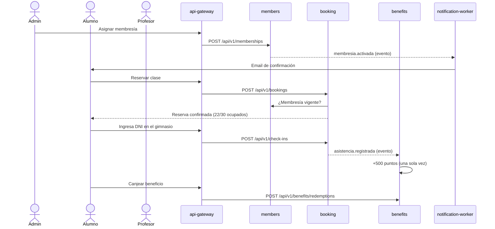

# METALFITNESS

Trabajo Práctico Integrador de **Arquitectura de Software**: METALFITNESS es un sistema de microservicios para gestionar alumnos, membresías, clases y reservas, asistencia, entrenamiento, nutrición y un **Club de Beneficios** con puntos que también usan sistemas de otros grupos.

> Estado: **esqueleto del proyecto**. Todos los servicios arrancan, verifican sus bases y reportan su estado en una pantalla web; todavía no hay funcionalidades de negocio. El contrato de la API de partners ya está publicado, con mock.

## Dominio

| Actor | Qué hace |
|---|---|
| **Administrador** | Gestiona alumnos, profesionales, membresías, actividades, clases, horarios y beneficios. |
| **Profesor** | Consulta sus clases y alumnos y arma planes de entrenamiento. La asistencia se registra automáticamente al ingresar con DNI. |
| **Nutricionista** | Carga planes alimenticios, registra mediciones y responde consultas de sus pacientes. |
| **Alumno** | Reserva clases, consulta su membresía, planes, mediciones y puntos; canjea beneficios. |

Actividades: **Musculación** (7 turnos diarios de 2 horas entre 08:00 y 22:00, dentro del horario de apertura 08:00–23:00, hasta 50 alumnos) y **Funcional, GAP, Strong Nation y Zumba** (horarios configurables, hasta 30 alumnos). Cada clase asistida suma **500 puntos**; una reserva confirmada no asistida descuenta hasta **100 puntos**, sin saldo negativo. Las reservas se pueden cancelar hasta **1 hora antes** del inicio.

El Club de Beneficios expone una API pública para integraciones externas. Los sistemas de otros grupos no son usuarios ni roles del gimnasio: se autentican con API key y solo operan sobre cuentas de alumnos previamente vinculadas por un administrador. METALFITNESS envía directamente al alumno los emails de confirmación, recordatorio 10 días antes y advertencia el día del vencimiento de su membresía; el partner no interviene en esas notificaciones.

## Objetivo

Diseñar y construir un sistema distribuido que muestre, sobre un dominio concreto, decisiones de arquitectura justificadas: límites de servicios por capacidad de negocio, base de datos por servicio, patrones internos (capas y hexagonal), CQRS de lectura, mensajería con outbox, idempotencia, balanceo, observabilidad y una API publicada para terceros.

## Flujo principal



El detalle completo, con criterios de aceptación, está en [SPEC.md §11](SPEC.md#11-criterios-de-aceptación-del-flujo-principal-de-punta-a-punta).

## Arquitectura en una tabla

| Componente | Responsabilidad | Datos | Patrón | Puerto |
|---|---|---|---|---|
| `web` | SPA para todos los actores | — | React + Vite + TS | 5173 |
| `api-gateway` | Entrada única: JWT, rate limit, routing | Redis | Middlewares | 8080 |
| `members-service` | Usuarios, login, roles, membresías | PostgreSQL `members_db` | Capas | 8081 |
| `booking-service` (+ `booking-indexer`) | Actividades, clases, reservas, asistencia | PostgreSQL `booking_db` + OpenSearch | Hexagonal + CQRS | 8082 (indexer 8086) |
| `benefits-service` | Club de Beneficios y API v1 para partners | PostgreSQL `benefits_db` | Hexagonal | 8083 |
| `training-service` | Planes, mediciones, consultas | MongoDB `training_db` | Capas | 8084 |
| `notification-worker` | Emails de confirmación y vencimiento de membresía | MongoDB `notifications_db` | Consumidor | 8085 |

Más detalle en [docs/ARCHITECTURE.md](docs/ARCHITECTURE.md).

## Cómo ejecutarlo localmente

### Requisitos previos

| Herramienta | Para qué | Versión |
|---|---|---|
| Docker + Docker Compose v2 | Levantar el stack | Docker Desktop reciente (Compose ≥ 2.20) |
| GNU Make | Atajos `make up`, `make test`… | 4.x — en Windows: `winget install ezwinports.make`, y ejecutá `make` desde **Git Bash** o WSL |
| Go | Tests y lint fuera de contenedores | 1.22 o superior |
| Node.js | Solo para desarrollar el frontend fuera de Docker | 20 |

Recursos: ~4 GB de RAM y **unos 6 GB libres en disco** para imágenes y builds del stack actual (crecerá con OpenSearch y la observabilidad).

### Levantar todo

```bash
cp .env.example .env && make up
```

`make up` construye las imágenes, levanta todos los contenedores y **espera a que estén healthy**. Después:

- Abrí **http://localhost:5173**: la pantalla "Estado del sistema" debe mostrar todos los servicios en **Listo**.
- O consultá el gateway: `curl http://localhost:8080/api/v1/status` → `"status": "ready"`.

Sin `make`: `docker compose --env-file .env -f deploy/docker-compose.yml up -d --build --wait`.

### Otros comandos

| Comando | Qué hace |
|---|---|
| `make down` | Baja el stack (conserva los datos) |
| `make clean` | Baja el stack y borra los volúmenes |
| `make logs s=api-gateway` | Logs en vivo (sin `s=`, de todos) |
| `make ps` | Estado de los contenedores |
| `make test` | Tests de todos los módulos Go (los de integración usan Docker con testcontainers) |
| `make lint` | `go vet`, `golangci-lint` y chequeo de tipos del frontend |
| `make fmt` | Formatea el código Go |
| `make help` | Lista todos los comandos |

### URLs de cada componente

| URL | Componente |
|---|---|
| http://localhost:5173 | Frontend (pantalla "Estado del sistema") |
| http://localhost:8080 | api-gateway — único punto de entrada |
| http://localhost:8080/api/v1/status | Estado agregado de todos los servicios |
| http://localhost:4010 | Mock de la API de partners (Prism) |
| http://localhost:15672 | RabbitMQ management (usuario y contraseña en `.env`) |
| http://127.0.0.1:8081/health/ready | members-service (acceso directo solo para depurar) |
| http://127.0.0.1:8082/health/ready | booking-service |
| http://127.0.0.1:8083/health/ready | benefits-service |
| http://127.0.0.1:8084/health/ready | training-service |
| http://127.0.0.1:8085/health/ready | notification-worker |
| http://127.0.0.1:8086/health/ready | booking-indexer |
| `127.0.0.1:5432` / `127.0.0.1:27017` / `127.0.0.1:6379` | PostgreSQL / MongoDB / Redis (credenciales en `.env`) |

Mailpit, Jaeger, Grafana, Traefik y OpenSearch se suman en las etapas que los usan.

## Mock de la API de partners (disponible ya)

El contrato público del Club de Beneficios ([docs/contracts/benefits-api.v1.yaml](docs/contracts/benefits-api.v1.yaml)) se puede probar hoy con un mock (Prism) que responde con los ejemplos del contrato. Solo requiere Docker.

```bash
docker compose -f deploy/docker-compose.mock.yml up -d     # o: make mock-up   → http://localhost:4010
docker compose -f deploy/docker-compose.mock.yml down      # o: make mock-down
```

Prueba rápida:

```bash
curl -s http://localhost:4010/v1/accounts/cli-10045/balance -H "X-API-Key: demo-partner-key"
```

Validar el contrato con Spectral: `make contract-lint` (o el comando `docker run` equivalente). Ejemplos completos, errores y reintentos en la [guía de integración](docs/contracts/README.md).

## Documentación

| Documento | Contenido |
|---|---|
| [SPEC.md](SPEC.md) | Especificación funcional aprobada: HU, reglas de negocio, estados, casos límite |
| [docs/ARCHITECTURE.md](docs/ARCHITECTURE.md) | Arquitectura: C4, servicios, comunicaciones, eventos, despliegue, limitaciones |
| [docs/adr/](docs/adr/) | Registros de decisiones de arquitectura (ADR) |
| [docs/contracts/](docs/contracts/README.md) | **Contrato público** del Club de Beneficios para otros grupos: [benefits-api.v1.yaml](docs/contracts/benefits-api.v1.yaml) (OpenAPI 3.1), guía de integración y mock |
| [Registro_de_Decisiones_Gimnasio.docx](Registro_de_Decisiones_Gimnasio.docx) | Registro de decisiones del grupo (D-01 en adelante) |
| [CONTRIBUTING.md](CONTRIBUTING.md) | Ramas, commits, PR y revisión |
| [CLAUDE.md](CLAUDE.md) | Contexto y reglas para asistentes de IA en este repo |

## Equipo

| Apellido | Nombre | Clave UCC |
|---|---|---|
| Pastore | Martina | 2416245 |
| Schaffer | Matías | 2434073 |
| Viti | María Guadalupe | 2426038 |
