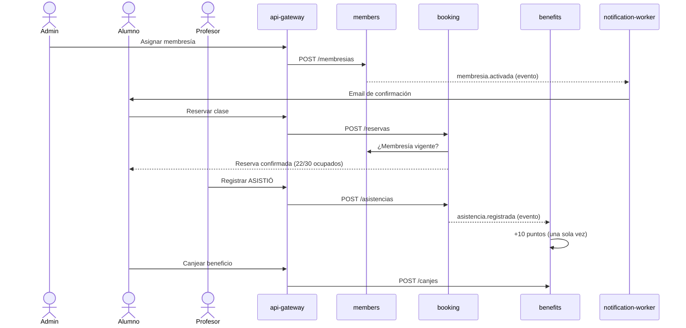

# Sistema Integral de Gestión de Gimnasio

Trabajo Práctico Integrador de **Arquitectura de Software**: un sistema de microservicios para gestionar un gimnasio — alumnos, membresías, clases y reservas, asistencia, entrenamiento, nutrición y un **Club de Beneficios** con puntos que también usan sistemas de otros grupos.

> Estado: **etapa 02 — arquitectura definida**. Todavía no hay código de aplicación.

## Dominio

| Actor | Qué hace |
|---|---|
| **Administrador** | Gestiona alumnos, profesionales, membresías, actividades, clases, horarios y beneficios. |
| **Profesor** | Consulta sus clases y alumnos, registra asistencia y arma planes de entrenamiento. |
| **Nutricionista** | Carga planes alimenticios, registra mediciones y responde consultas de sus pacientes. |
| **Alumno** | Reserva clases, consulta su membresía, planes, mediciones y puntos; canjea beneficios. |
| **Partner externo** | Sistema de otro grupo que acredita, debita, canjea y consulta puntos por API. |

Actividades: **Musculación** (4 turnos diarios entre 08:00 y 23:00, hasta 50 alumnos) y **Funcional, GAP, Strong Nation y Zumba** (horarios configurables, hasta 30 alumnos). La asistencia confirmada suma puntos: 5 en Musculación, 10 en el resto.

## Objetivo

Diseñar y construir un sistema distribuido que muestre, sobre un dominio concreto, decisiones de arquitectura justificadas: límites de servicios por capacidad de negocio, base de datos por servicio, patrones internos (capas y hexagonal), CQRS de lectura, mensajería con outbox, idempotencia, balanceo, observabilidad y una API publicada para terceros.

## Flujo principal



El detalle completo, con criterios de aceptación, está en [SPEC.md §11](SPEC.md#11-criterios-de-aceptación-del-flujo-principal-de-punta-a-punta).

## Arquitectura en una tabla

| Componente | Responsabilidad | Datos | Patrón | Puerto |
|---|---|---|---|---|
| `web` | SPA para todos los actores | — | React + Vite + TS | 5173 |
| `api-gateway` | Entrada única: JWT, rate limit, routing | Redis | Middlewares | 8080 |
| `members-service` | Usuarios, login, roles, membresías | PostgreSQL `members_db` | Capas | 8081 |
| `booking-service` (×2) | Actividades, clases, reservas, asistencia | PostgreSQL `booking_db` + OpenSearch | Hexagonal + CQRS | 8082 |
| `benefits-service` | Club de Beneficios y API v1 para partners | PostgreSQL `benefits_db` | Hexagonal | 8083 |
| `training-service` | Planes, mediciones, consultas | MongoDB `training_db` | Capas | 8084 |
| `notification-worker` | Emails de membresía | MongoDB `notifications_db` | Consumidor | 8085 |

Más detalle en [docs/ARCHITECTURE.md](docs/ARCHITECTURE.md).

## Cómo se ejecutará localmente

> Disponible a partir de la etapa de implementación.

Requisitos: Docker + Docker Compose, GNU Make, Go 1.22+ y Node 20+ (solo para desarrollo fuera de contenedores). Se recomiendan ~8 GB de RAM libres.

```bash
cp deploy/compose/.env.example deploy/compose/.env
make up          # levanta todo el stack
make test        # tests unitarios y de integración (testcontainers)
make down        # baja el stack
```

| URL | Qué es |
|---|---|
| http://localhost:5173 | Frontend |
| http://localhost:8080 | API Gateway |
| http://localhost:8025 | Mailpit (emails enviados) |
| http://localhost:15672 | RabbitMQ management |
| http://localhost:16686 | Jaeger (trazas) |
| http://localhost:3000 | Grafana (métricas y logs) |

## Documentación

| Documento | Contenido |
|---|---|
| [SPEC.md](SPEC.md) | Especificación funcional aprobada: HU, reglas de negocio, estados, casos límite |
| [docs/ARCHITECTURE.md](docs/ARCHITECTURE.md) | Arquitectura: C4, servicios, comunicaciones, eventos, despliegue, limitaciones |
| [docs/adr/](docs/adr/) | Registros de decisiones de arquitectura (ADR) |
| [CONTRIBUTING.md](CONTRIBUTING.md) | Ramas, commits, PR y revisión |
| [CLAUDE.md](CLAUDE.md) | Contexto y reglas para asistentes de IA en este repo |

## Equipo

| Apellido | Nombre | Clave UCC |
|---|---|---|
| Pastore | Martina | 2416245 |
| Schaffer | Matías | 2434073 |
| Viti | María Guadalupe | 2426038 |
