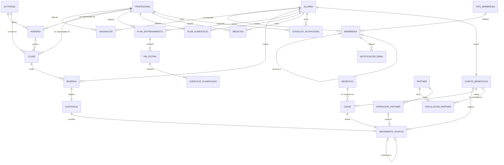
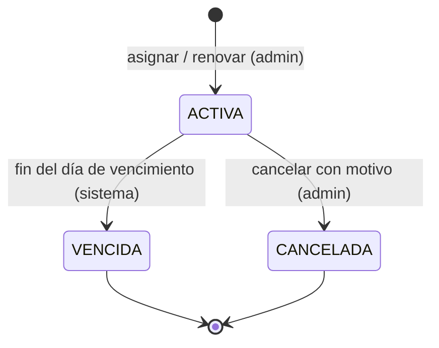
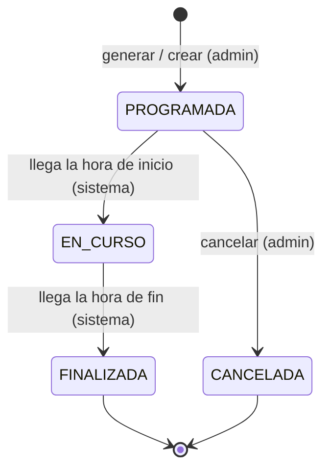
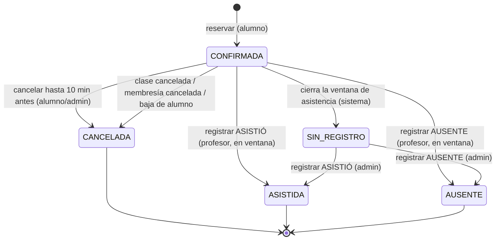
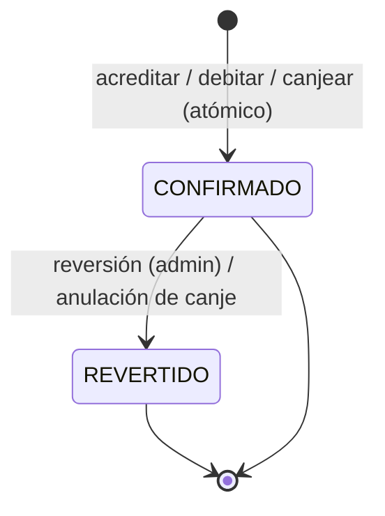

# SPEC — Sistema Integral de Gestión de Gimnasio

> Especificación funcional del Trabajo Práctico Integrador de Arquitectura de Software (microservicios).
> Este documento es la **referencia funcional** durante todo el desarrollo. No define tecnologías, lenguajes, frameworks ni modelos de base de datos.
>
> - Versión: 0.4 (decisiones D-01…D-19 confirmadas)
> - Fecha: 2026-10-07
> - Convenciones: `HU-xx` = historia de usuario, `RN-xx` = regla de negocio, `CU-xx` = caso de uso, `CL-xx` = caso límite, `E2E-xx` = criterio de aceptación de punta a punta. Las palabras **DEBE**, **NO DEBE** y **PUEDE** tienen sentido normativo.

---

## Índice

1. [Objetivo, alcance, fuera de alcance y supuestos](#1-objetivo-alcance-fuera-de-alcance-y-supuestos)
2. [Glosario (lenguaje ubicuo)](#2-glosario-lenguaje-ubicuo)
3. [Funcionalidades por actor](#3-funcionalidades-por-actor)
4. [Historias de usuario](#4-historias-de-usuario)
5. [Reglas de negocio](#5-reglas-de-negocio)
6. [Entidades, atributos y relaciones](#6-entidades-atributos-y-relaciones)
7. [Estados y transiciones](#7-estados-y-transiciones)
8. [Casos de uso principales](#8-casos-de-uso-principales)
9. [Validaciones por operación](#9-validaciones-por-operación)
10. [Casos límite](#10-casos-límite)
11. [Criterios de aceptación del flujo principal de punta a punta](#11-criterios-de-aceptación-del-flujo-principal-de-punta-a-punta)
12. [Matriz de trazabilidad HU ↔ RN](#12-matriz-de-trazabilidad-hu--rn)

---

## 1. Objetivo, alcance, fuera de alcance y supuestos

### 1.1 Objetivo

Construir un sistema que permita a un gimnasio administrar de forma integral a sus alumnos, profesionales, membresías, actividades, clases y reservas; acompañar el seguimiento de entrenamiento y nutrición de cada alumno; y fidelizarlos mediante un **Club de Beneficios** basado en puntos que, además, se expone a sistemas de terceros (**partners**) a través de una API pública.

### 1.2 Alcance

Dentro del alcance de esta especificación:

| Área | Incluye |
|---|---|
| Identidad y acceso | Usuarios con rol ADMINISTRADOR, PROFESIONAL (PROFESOR / NUTRICIONISTA) y ALUMNO. Las integraciones externas usan credenciales propias de la API pública. Cada usuario o integración opera solo dentro de sus permisos. |
| Alumnos y profesionales | Alta, modificación, baja lógica y consulta. Asignación de alumnos a profesionales. |
| Membresías | Tipos de membresía, asignación, renovación, cancelación, vencimiento automático y email de confirmación asíncrono. |
| Actividades y clases | Actividades (Musculación, Funcional, GAP, Strong Nation, Zumba), horarios recurrentes, generación de clases/turnos, capacidad, ocupación y cancelación de clases. |
| Reservas | Reservar, cancelar y consultar reservas con control de cupo, concurrencia e idempotencia. |
| Asistencia | Registro de ASISTIÓ / AUSENTE por el profesor responsable. |
| Entrenamiento | Planes de entrenamiento con días/rutinas y ejercicios. |
| Nutrición | Planes alimenticios, mediciones corporales (historial inmutable) y consultas de los alumnos a su nutricionista. |
| Club de Beneficios | Cuenta de puntos, saldo, movimientos, catálogo de beneficios, canjes, acreditación automática por asistencia. |
| API pública para partners | Acreditar, debitar, canjear, consultar saldo y movimientos de las cuentas vinculadas al partner, con idempotencia. |
| Notificaciones | Email de confirmación de membresía asignada o renovada (asíncrono). |

### 1.3 Fuera de alcance

- Cobro, facturación, medios de pago y precios de membresías (se registra el tipo de membresía, no el pago).
- Control de acceso físico (molinetes, QR, huella).
- Aplicación móvil nativa (se asume un único cliente web/genérico; el canal no se especifica).
- Lista de espera para clases completas.
- Vencimiento de puntos por antigüedad.
- Stock o disponibilidad limitada de beneficios (siempre hay beneficios disponibles; el catálogo lo mantiene el administrador).
- Usuarios de partners que no sean alumnos del gimnasio.
- Notificaciones distintas del email de membresía (recordatorios de clase, push, SMS, avisos de cancelación de clase). *Ver dudas.*
- Recuperación de contraseña, doble factor y autogestión del registro por parte del alumno (el alta la hace el administrador).
- Reportes estadísticos y tableros de gestión.
- Gestión de salas/espacios físicos y equipamiento.
- Multi-sede (se asume una única sede).
- Prestaciones del partner hacia nuestros alumnos (solo exponemos nuestra API; no consumimos la de ellos).

### 1.4 Supuestos

| ID | Supuesto |
|---|---|
| S-01 | Existe una única sede y una única zona horaria de referencia: **America/Argentina/Buenos_Aires**. Todas las fechas y horas de negocio ("hoy", "futura", "vence hoy") se evalúan en esa zona. |
| S-02 | Musculación funciona de lunes a domingo entre **08:00 y 23:00**, con **7 turnos reservables de 2 horas por día**: 08:00–10:00, 10:00–12:00, 12:00–14:00, 14:00–16:00, 16:00–18:00, 18:00–20:00 y 20:00–22:00. El administrador puede cancelar un turno puntual. |
| S-03 | Las clases del resto de las actividades duran lo que defina su horario (por defecto 60 minutos). |
| S-04 | Una membresía es **vigente** durante todo el día de su fecha de vencimiento (hasta las 23:59:59 de ese día). |
| S-05 | Para reservar, la membresía debe estar vigente **al momento de reservar y en la fecha de la clase**. |
| S-06 | Un alumno puede cancelar una reserva hasta **10 minutos antes** del inicio de la clase. No hay otro límite de reservas activas por alumno que los de RN-39 y RN-40. |
| S-07 | La asistencia solo se registra sobre alumnos con **reserva activa** en esa clase (no hay "asistencia sin reserva"). |
| S-08 | El profesor puede registrar la asistencia desde el inicio de la clase hasta **1 hora después de su finalización**; una vez registrada **no la modifica**. Las reservas que quedan sin registrar pasan a **SIN_REGISTRO** y luego solo el administrador puede registrarlas (ver RN-38). Las correcciones de puntos las hace el administrador mediante reversión (RN-25). |
| S-09 | Los puntos son números **enteros positivos**. El saldo nunca puede ser negativo. |
| S-10 | Cada alumno tiene exactamente una **cuenta de beneficios**, creada automáticamente al darlo de alta. |
| S-11 | Los "usuarios propios" de un partner son **cuentas de beneficios de alumnos del gimnasio vinculadas a ese partner** (mediante un identificador externo del partner). No existen cuentas de personas que no sean alumnos. Un partner solo opera sobre cuentas vinculadas a él. |
| S-12 | Un alumno tiene como máximo **un plan de entrenamiento vigente** y **un plan alimenticio vigente** a la vez; los anteriores se conservan como historial. |
| S-13 | La renovación de una membresía genera una **nueva membresía** (no modifica la anterior), para conservar el historial. |
| S-14 | Las bajas de alumnos, profesionales, actividades y beneficios son **lógicas** (se inactivan, no se borran) para preservar la trazabilidad. |
| S-15 | El partner y el sistema comparten la noción de **identificador de operación** (clave de idempotencia) que el partner genera y envía en cada operación de escritura. |
| S-16 | Los **nutricionistas no dictan clases ni arman planes de entrenamiento**: cargan planes alimenticios, registran mediciones y responden consultas de sus pacientes. Las clases y los planes de entrenamiento son exclusivos de los **profesores**. |

---

## 2. Glosario (lenguaje ubicuo)

| Término | Definición |
|---|---|
| **Administrador** | Usuario del gimnasio con permisos de gestión total sobre maestros (alumnos, profesionales, actividades, beneficios, partners), membresías y clases. |
| **Alumno** | Persona que asiste al gimnasio. Tiene membresías, reservas, planes, mediciones y una cuenta de beneficios. |
| **Profesional** | Persona que trabaja en el gimnasio. Tiene subtipo **PROFESOR** o **NUTRICIONISTA**. |
| **Profesor** | Profesional que dicta clases, registra asistencias y gestiona planes de entrenamiento. Es el único que puede ser responsable de una clase. |
| **Nutricionista** | Profesional que carga planes alimenticios, registra mediciones corporales y responde consultas de sus pacientes. No dicta clases ni arma planes de entrenamiento. |
| **Alumno asignado** | Alumno vinculado a un profesional por el administrador para seguimiento (planes, mediciones, consultas). |
| **Paciente** | Alumno asignado a un nutricionista. |
| **Consulta nutricional** | Duda que un alumno envía a su nutricionista y que este responde dentro del sistema. |
| **Actividad** | Disciplina ofrecida por el gimnasio (Musculación, Funcional, GAP, Strong Nation, Zumba). Define capacidad máxima y puntos por asistencia. |
| **Horario** | Plantilla recurrente de una actividad: día de la semana, hora de inicio, duración, capacidad y profesor responsable. A partir de los horarios se generan clases. |
| **Clase** | Instancia concreta de una actividad en una fecha y hora determinadas, con capacidad y un profesor responsable. Es lo que se reserva. |
| **Turno** | Nombre que recibe una clase de **Musculación**: una de las 7 franjas diarias de 2 horas dentro de 08:00–23:00, con capacidad máxima 50. A efectos del sistema, un turno **es** una clase. |
| **Capacidad** | Cantidad máxima de reservas activas que admite una clase. Nunca supera el máximo de la actividad (50 Musculación, 30 el resto). |
| **Ocupación** | Cantidad de reservas activas de una clase. Se muestra como `ocupados/capacidad - disponibles` (ej.: `21/30 ocupados - 9 disponibles`). |
| **Cupo** | Lugar disponible en una clase: `cupo disponible = capacidad − ocupación`. "Hay cupo" ⇔ cupo disponible > 0. |
| **Clase futura** | Clase cuya fecha-hora de inicio es **estrictamente posterior** al instante actual. |
| **Clase iniciada** | Clase cuya fecha-hora de inicio es menor o igual al instante actual (en curso o finalizada). |
| **Membresía** | Habilitación de un alumno para usar el gimnasio durante un período (tipo, fecha de inicio, fecha de vencimiento, estado). |
| **Tipo de membresía** | Plan comercial que define la duración por defecto. Tipos iniciales: **Mensual** (1 mes), **Trimestral** (3 meses) y **Anual** (12 meses). |
| **Membresía vigente** | Membresía en estado **ACTIVA** cuya fecha de inicio ≤ fecha de referencia ≤ fecha de vencimiento (ver RN-01). |
| **Renovación** | Asignación de una nueva membresía a un alumno que ya tuvo o tiene una, con continuidad de fechas. |
| **Reserva** | Lugar tomado por un alumno en una clase. |
| **Reserva activa** | Reserva en estado **CONFIRMADA**: ocupa cupo y habilita el registro de asistencia. |
| **Asistencia** | Registro, hecho por el profesor responsable (o por el administrador), de si el alumno con reserva activa **ASISTIÓ** o estuvo **AUSENTE**. |
| **Ventana de asistencia** | Período en el que el profesor responsable puede registrar asistencia: desde el inicio de la clase hasta 1 hora después de su fin. |
| **Reserva sin registro** | Reserva en estado **SIN_REGISTRO**: estaba CONFIRMADA y la ventana de asistencia cerró sin que se registrara. Solo el administrador puede registrarle asistencia. |
| **Plazo de cancelación** | Una reserva puede cancelarse hasta 10 minutos antes del inicio de la clase. |
| **Asistencia confirmada** | Asistencia con resultado **ASISTIÓ**. Es el único hecho que genera puntos de forma automática. |
| **Club de Beneficios** | Programa de fidelización basado en puntos. |
| **Cuenta de beneficios** | Contenedor de puntos de un alumno. Tiene saldo e historial de movimientos. Puede estar vinculada a uno o más partners. |
| **Saldo** | Suma algebraica de los movimientos confirmados de una cuenta. Nunca es negativo. |
| **Movimiento de puntos** | Registro inmutable de una acreditación (+) o débito (−) de puntos, con fecha, motivo, origen y estado. |
| **Acreditar** | Sumar puntos a una cuenta mediante un movimiento positivo. |
| **Debitar** | Restar puntos de una cuenta mediante un movimiento negativo. |
| **Beneficio** | Ítem del catálogo canjeable por puntos (descuento, producto, servicio), con costo en puntos y vigencia. No tiene stock: mientras esté activo y vigente, siempre está disponible. El administrador lo modifica cuando quiere. |
| **Canje** | Intercambio de puntos por un beneficio del catálogo. Genera un débito. |
| **Reversión** | Anulación de un movimiento confirmado mediante un movimiento compensatorio de signo opuesto. Nunca se borra ni edita el original. |
| **Partner** | Sistema externo (de otro grupo) autorizado a usar la API pública del Club de Beneficios. |
| **Vinculación de partner** | Asociación entre un partner, un identificador externo de usuario del partner y una cuenta de beneficios. Define los "usuarios propios" del partner. |
| **Operación de partner** | Solicitud de escritura (acreditar, debitar, canjear) enviada por un partner, identificada por un **identificador de operación** único por partner. |
| **Idempotencia** | Propiedad por la cual repetir la misma solicitud (mismo identificador) produce el mismo resultado que la primera vez, sin efectos adicionales. |
| **Clave de idempotencia** | Identificador que el cliente envía con una solicitud de escritura para que el sistema pueda detectar repeticiones (doble clic, reintentos). |
| **Plan de entrenamiento** | Programa asignado a un alumno: objetivo, vigencia, observaciones, días/rutinas y ejercicios. |
| **Día de rutina** | Sesión dentro de un plan de entrenamiento (ej.: "Día A – Tren superior"), con su lista ordenada de ejercicios. |
| **Ejercicio planificado** | Ejercicio dentro de un día de rutina: nombre, grupo muscular, series, repeticiones, peso sugerido, descanso y observaciones. |
| **Plan alimenticio** | Indicaciones nutricionales: desayuno, colación, almuerzo, merienda, cena y observaciones. |
| **Medición corporal** | Registro inmutable de fecha, peso, % grasa, % muscular, masa muscular y observaciones. |
| **Evolución** | Serie temporal de mediciones de un alumno. |

---

## 3. Funcionalidades por actor

### 3.1 Administrador

- Gestionar **alumnos**: alta (crea también su cuenta de beneficios), modificación, baja lógica, consulta y búsqueda.
- Gestionar **profesionales**: alta indicando subtipo (PROFESOR / NUTRICIONISTA), modificación, baja lógica, consulta.
- **Asignar y desasignar alumnos** a profesionales.
- Gestionar **tipos de membresía** (nombre, duración por defecto).
- **Asignar, renovar y cancelar membresías**; consultar el historial de membresías de un alumno.
- Gestionar **actividades**: alta, modificación, inactivación; configurar capacidad máxima y puntos por asistencia.
- Gestionar **horarios** recurrentes (día, hora, duración, capacidad, profesor responsable) y **generar clases**.
- Modificar **capacidad** y **profesor responsable** de una clase concreta; **cancelar clases**.
- Consultar clases con su ocupación y listado de reservas.
- Gestionar el **catálogo de beneficios** (alta, modificación de costo/descripción/vigencia, inactivación).
- **Registrar asistencia de reservas SIN_REGISTRO** (fuera de la ventana del profesor).
- Gestionar **partners**: alta, emisión/revocación de credenciales, baja; gestionar vinculaciones de cuentas.
- **Revertir movimientos de puntos** erróneos y anular canjes.
- Consultar saldo y movimientos de cualquier cuenta.

### 3.2 Profesor

- Consultar **sus clases** (en las que es responsable) con ocupación y listado de alumnos con reserva.
- Consultar **sus alumnos** (asignados y/o con reserva en sus clases).
- **Registrar asistencia** (ASISTIÓ / AUSENTE) de los alumnos con reserva activa en sus clases, dentro de la ventana de asistencia.
- **Gestionar planes de entrenamiento** de sus alumnos asignados: crear, modificar, finalizar; consultar historial.

### 3.3 Nutricionista

- Consultar **sus pacientes** (alumnos asignados).
- **Cargar y actualizar planes alimenticios** de sus pacientes.
- **Registrar mediciones corporales** y consultar la evolución.
- **Ver y responder las consultas** que le envían sus pacientes.
- No dicta clases, no registra asistencias y no gestiona planes de entrenamiento.

### 3.4 Alumno

- Consultar su **membresía** vigente y su historial.
- Consultar **clases disponibles** con ocupación (filtrar por actividad, fecha).
- **Reservar** una clase y **cancelar** una reserva futura.
- Consultar **sus reservas** (futuras e historial con resultado de asistencia).
- Consultar su **plan de entrenamiento** vigente.
- Consultar su **plan nutricional** vigente y sus **mediciones** (evolución).
- **Enviar consultas** a su nutricionista y ver las respuestas.
- Consultar su **saldo**, **historial de movimientos**, **catálogo de beneficios**, **canjear** un beneficio y ver sus **canjes**.

### 3.5 Integración externa del Club de Beneficios

La API pública del Club de Beneficios permite que sistemas externos:

- **Acrediten** puntos a una cuenta vinculada.
- **Debiten** puntos de una cuenta vinculada.
- **Canjeen** un beneficio del catálogo en nombre de una cuenta vinculada.
- **Consulten saldo** y **movimientos** de una cuenta vinculada.
- Consulten el **catálogo de beneficios** habilitado para canje externo.
- Ejecuten operaciones de escritura con **idempotencia** por identificador de operación.

La integración externa no es un usuario ni un rol del sistema. El administrador crea y administra sus credenciales; `benefits-service` autentica cada solicitud mediante `X-API-Key` y limita el acceso a las cuentas vinculadas.

### 3.6 Procesos automáticos del sistema

- **Vencer membresías** automáticamente al terminar el día de vencimiento.
- **Pasar clases** a EN_CURSO y FINALIZADA según su horario.
- **Pasar a SIN_REGISTRO** las reservas CONFIRMADA cuya ventana de asistencia cerró.
- **Acreditar puntos** por cada asistencia confirmada (exactamente una vez).
- **Enviar el email** de confirmación de membresía de forma asíncrona, con reintentos.

---

## 4. Historias de usuario

> Formato: *Como <actor>, quiero <acción>, para <beneficio>.* Criterios en **Dado / Cuando / Entonces**.

### 4.1 Administrador

#### HU-01 — Gestionar alumnos
*Como administrador, quiero dar de alta, modificar, dar de baja y consultar alumnos, para mantener el padrón actualizado.*
Reglas: RN-30, RN-33, RN-34.

- **CA-01.1** Dado un DNI que no existe, cuando el administrador da de alta un alumno con datos obligatorios válidos, entonces el alumno queda ACTIVO y se le crea una cuenta de beneficios con saldo 0.
- **CA-01.2** Dado un alumno existente con DNI X, cuando se intenta dar de alta otro alumno con DNI X o el mismo email, entonces la operación se rechaza indicando duplicado.
- **CA-01.3** Dado un alumno con reservas futuras activas, cuando el administrador lo da de baja, entonces el alumno queda INACTIVO, sus reservas futuras pasan a CANCELADA y su historial se conserva.
- **CA-01.4** Dado un alumno INACTIVO, cuando intenta iniciar sesión, entonces el acceso se rechaza.

#### HU-02 — Gestionar profesionales
*Como administrador, quiero gestionar profesionales y su subtipo, para asignarles clases y alumnos.*
Reglas: RN-08, RN-30, RN-34.

- **CA-02.1** Dado un alta de profesional con subtipo PROFESOR o NUTRICIONISTA, cuando se confirma, entonces queda ACTIVO con ese subtipo.
- **CA-02.2** Dado un alta sin subtipo o con un subtipo distinto, cuando se confirma, entonces se rechaza.
- **CA-02.3** Dado un profesor responsable de clases futuras PROGRAMADA, cuando el administrador intenta darlo de baja, entonces se rechaza hasta que esas clases se reasignen o cancelen.
- **CA-02.4** Dado un alumno y un profesional activos, cuando el administrador asigna el alumno al profesional, entonces el alumno aparece en "mis alumnos" del profesional.

#### HU-03 — Asignar membresía
*Como administrador, quiero asignar una membresía a un alumno, para habilitarlo a usar el gimnasio.*
Reglas: RN-01, RN-02, RN-05.

- **CA-03.0** Dado el sistema recién instalado, cuando el administrador consulta los tipos de membresía, entonces existen Mensual (1 mes), Trimestral (3 meses) y Anual (12 meses).
- **CA-03.1** Dado un alumno activo sin membresía vigente, cuando el administrador le asigna una membresía Mensual con inicio hoy, entonces se crea una membresía ACTIVA con vencimiento según el tipo y se encola un email de confirmación.
- **CA-03.2** Dado un alumno con membresía ACTIVA del 01/10 al 31/10, cuando se intenta asignar otra membresía cuyo período se superpone, entonces se rechaza por solapamiento.
- **CA-03.3** Dado una fecha de vencimiento anterior a la de inicio, cuando se intenta asignar, entonces se rechaza.
- **CA-03.4** Dado que el servicio de email no está disponible, cuando se asigna la membresía, entonces la membresía queda igualmente ACTIVA y el email se reintenta luego.

#### HU-04 — Renovar membresía
*Como administrador, quiero renovar la membresía de un alumno, para que continúe sin interrupciones.*
Reglas: RN-02, RN-05, RN-06.

- **CA-04.1** Dado un alumno con membresía ACTIVA que vence el 31/10, cuando el administrador la renueva con tipo Mensual, entonces se crea una nueva membresía ACTIVA con inicio 01/11, la anterior no se modifica y se encola un email de confirmación.
- **CA-04.2** Dado un alumno con membresía VENCIDA el 15/09, cuando se renueva hoy (07/10), entonces la nueva membresía inicia hoy (no retroactiva).
- **CA-04.3** Dado un alumno que ya tiene una renovación futura ACTIVA, cuando se intenta renovar otra vez, entonces la nueva comienza al día siguiente del vencimiento de la última membresía ACTIVA.

#### HU-05 — Cancelar membresía
*Como administrador, quiero cancelar una membresía, para dar de baja la habilitación de un alumno.*
Reglas: RN-04.

- **CA-05.1** Dada una membresía ACTIVA, cuando el administrador la cancela indicando motivo, entonces pasa a CANCELADA y las reservas futuras del alumno que dependían de ella pasan a CANCELADA.
- **CA-05.2** Dada una membresía VENCIDA o CANCELADA, cuando se intenta cancelar, entonces se rechaza por transición inválida.

#### HU-06 — Gestionar actividades
*Como administrador, quiero gestionar las actividades, para definir la oferta del gimnasio.*
Reglas: RN-07, RN-08, RN-20.

- **CA-06.1** Dado el sistema recién instalado, cuando se consulta el catálogo de actividades, entonces existen Musculación (máx. 50, 5 puntos), Funcional, GAP, Strong Nation y Zumba (máx. 30, 10 puntos).
- **CA-06.2** Dada una actividad, cuando se intenta configurar una capacidad máxima mayor al tope (50 Musculación / 30 resto), entonces se rechaza.
- **CA-06.3** Dada una actividad con clases futuras con reservas, cuando se inactiva, entonces se rechaza hasta que las clases futuras se cancelen.

#### HU-07 — Configurar horarios y generar clases
*Como administrador, quiero definir horarios recurrentes y generar las clases, para que los alumnos puedan reservar.*
Reglas: RN-07, RN-08, RN-09, RN-10.

- **CA-07.1** Dado el horario de Musculación, cuando se generan las clases de una semana, entonces existen 7 turnos de 2 horas por día (08:00–10:00, 10:00–12:00, 12:00–14:00, 14:00–16:00, 16:00–18:00, 18:00–20:00 y 20:00–22:00), cada uno con capacidad 50.
- **CA-07.2** Dado un horario de Zumba los martes 19:00 de 60 minutos, cuando se generan las clases del mes, entonces se crea una clase PROGRAMADA por cada martes con capacidad ≤ 30 y el profesor responsable indicado.
- **CA-07.3** Dado un turno de Musculación que no coincide con una de las 7 franjas de 2 horas (ej.: 22:30–23:30), cuando se intenta crear, entonces se rechaza.
- **CA-07.4** Dado un profesor con una clase de 19:00 a 20:00, cuando se le asigna otra clase que se superpone, entonces se rechaza.
- **CA-07.6** Dado un profesional de subtipo NUTRICIONISTA, cuando se lo intenta asignar como responsable de un horario o una clase, entonces se rechaza.
- **CA-07.5** Dado que ya existen clases generadas para un período, cuando se regenera el mismo período, entonces no se duplican clases.

#### HU-08 — Modificar o cancelar una clase
*Como administrador, quiero modificar o cancelar una clase concreta, para reflejar imprevistos.*
Reglas: RN-10, RN-11, RN-32.

- **CA-08.1** Dada una clase PROGRAMADA con 21 reservas activas, cuando se intenta bajar la capacidad a 20, entonces se rechaza.
- **CA-08.2** Dada una clase PROGRAMADA con 21 reservas activas, cuando se baja la capacidad a 25, entonces la ocupación se muestra `21/25 ocupados - 4 disponibles`.
- **CA-08.3** Dada una clase PROGRAMADA con reservas, cuando el administrador la cancela, entonces pasa a CANCELADA y todas sus reservas activas pasan a CANCELADA (motivo: clase cancelada).
- **CA-08.4** Dada una clase EN_CURSO o FINALIZADA, cuando se intenta cancelar o modificar su capacidad, entonces se rechaza.

#### HU-09 — Gestionar catálogo de beneficios
*Como administrador, quiero gestionar los beneficios canjeables, para ofrecer incentivos.*
Reglas: RN-24.

- **CA-09.1** Dado un beneficio con nombre, costo en puntos > 0 y vigencia válida, cuando se da de alta, entonces queda ACTIVO y visible en el catálogo durante su vigencia.
- **CA-09.2** Dado un beneficio con costo 0 o negativo, cuando se intenta dar de alta, entonces se rechaza.
- **CA-09.3** Dado un beneficio con canjes realizados, cuando se inactiva, entonces deja de aparecer en el catálogo y los canjes previos se conservan.
- **CA-09.4** Dado un beneficio con canjes realizados, cuando el administrador cambia su costo, entonces los canjes nuevos usan el costo nuevo y los anteriores conservan los puntos que se debitaron.
- **CA-09.5** Dado un beneficio ACTIVO y vigente, cuando se canjea cualquier cantidad de veces, entonces sigue disponible (no hay stock).

#### HU-10 — Gestionar partners y vinculaciones
*Como administrador, quiero dar de alta partners y vincular cuentas, para habilitar la integración externa.*
Reglas: RN-26, RN-27.

- **CA-10.1** Dado un alta de partner, cuando se confirma, entonces el partner queda ACTIVO y se le emiten credenciales de acceso a la API pública.
- **CA-10.2** Dado un partner con credenciales revocadas o INACTIVO, cuando invoca cualquier operación, entonces se rechaza por falta de autorización.
- **CA-10.3** Dado un partner y una cuenta de beneficios, cuando se vincula la cuenta con un identificador externo, entonces el partner puede operar sobre ella usando ese identificador.
- **CA-10.4** Dado un identificador externo ya vinculado para ese partner, cuando se intenta vincular a otra cuenta, entonces se rechaza.

#### HU-11 — Revertir un movimiento de puntos
*Como administrador, quiero revertir un movimiento erróneo, para corregir saldos sin perder trazabilidad.*
Reglas: RN-22, RN-23, RN-25.

- **CA-11.1** Dado un movimiento CONFIRMADO de +10, cuando el administrador lo revierte indicando motivo, entonces se crea un movimiento compensatorio de −10, el original pasa a REVERTIDO y el saldo disminuye en 10.
- **CA-11.2** Dado un movimiento ya REVERTIDO, cuando se intenta revertir otra vez, entonces se rechaza.
- **CA-11.3** Dado un movimiento de +10 y un saldo actual de 4, cuando se intenta revertir, entonces se rechaza porque el saldo quedaría negativo.

#### HU-35 — Registrar asistencia de reservas sin registro
*Como administrador, quiero registrar la asistencia de las reservas que el profesor no registró a tiempo, para regularizar el historial y los puntos.*
Reglas: RN-20, RN-21, RN-38.

- **CA-35.1** Dada una reserva SIN_REGISTRO de Funcional, cuando el administrador registra ASISTIÓ, entonces la reserva pasa a ASISTIDA, la asistencia queda marcada como registrada por el administrador y se acreditan +10 puntos (una única vez).
- **CA-35.2** Dada una reserva SIN_REGISTRO, cuando el administrador registra AUSENTE, entonces pasa a AUSENTE sin puntos.
- **CA-35.3** Dada una reserva SIN_REGISTRO, cuando el profesor intenta registrarla, entonces se rechaza por ventana cerrada.
- **CA-35.4** Dada una reserva ya ASISTIDA o AUSENTE, cuando el administrador intenta registrarla otra vez, entonces se rechaza (la corrección de puntos se hace por reversión, HU-11).

### 4.2 Alumno

#### HU-12 — Consultar mi membresía
*Como alumno, quiero ver mi membresía, para saber hasta cuándo puedo entrenar.*
Reglas: RN-01, RN-30.

- **CA-12.1** Dado un alumno con membresía ACTIVA vigente, cuando la consulta, entonces ve tipo, fecha de inicio, vencimiento, estado y días restantes.
- **CA-12.2** Dado un alumno sin membresía vigente, cuando la consulta, entonces ve la última membresía con su estado (VENCIDA/CANCELADA) y un aviso de que no puede reservar.

#### HU-13 — Consultar clases disponibles
*Como alumno, quiero ver las clases futuras con su ocupación, para elegir a cuál ir.*
Reglas: RN-11, RN-12.

- **CA-13.1** Dada una clase de Funcional con capacidad 30 y 21 reservas activas, cuando el alumno la consulta, entonces ve `21/30 ocupados - 9 disponibles`.
- **CA-13.2** Dada una clase completa, cuando se lista, entonces se muestra como `30/30 ocupados - 0 disponibles` y no se ofrece reservar.
- **CA-13.3** Dada una clase CANCELADA o ya iniciada, cuando el alumno lista clases disponibles, entonces no aparece como reservable.
- **CA-13.4** Dada una clase en la que el alumno ya tiene reserva activa, cuando la consulta, entonces se indica "ya reservada".

#### HU-14 — Reservar una clase
*Como alumno, quiero reservar un lugar en una clase, para asegurarme el cupo.*
Reglas: RN-01, RN-12, RN-13, RN-14, RN-15, RN-16, RN-39, RN-40.

- **CA-14.1** Dado un alumno con membresía vigente y una clase futura PROGRAMADA con cupo, cuando reserva, entonces se crea una reserva CONFIRMADA, la ocupación aumenta en 1 y no se acreditan puntos.
- **CA-14.2** Dado un alumno sin membresía vigente, cuando intenta reservar, entonces se rechaza con el motivo "membresía no vigente".
- **CA-14.3** Dado un alumno cuya membresía vence antes de la fecha de la clase, cuando intenta reservar, entonces se rechaza.
- **CA-14.4** Dada una clase ya iniciada, cuando intenta reservar, entonces se rechaza con el motivo "clase no futura".
- **CA-14.5** Dada una clase sin cupo, cuando intenta reservar, entonces se rechaza con el motivo "sin cupo".
- **CA-14.6** Dado que el alumno ya tiene una reserva activa en la clase, cuando intenta reservar de nuevo con otra solicitud, entonces se rechaza con el motivo "reserva duplicada".
- **CA-14.7** Dado que el alumno envía dos veces la misma solicitud (misma clave de idempotencia), cuando el sistema procesa ambas, entonces existe una sola reserva y ambas respuestas devuelven la misma reserva.
- **CA-14.8** Dado un único lugar disponible y dos alumnos que reservan simultáneamente, cuando se procesan, entonces exactamente uno obtiene la reserva y el otro recibe "sin cupo"; la ocupación nunca supera la capacidad.
- **CA-14.9** Dado un alumno con reserva CONFIRMADA en el turno 08:00–10:00 de Musculación del 09/10, cuando intenta reservar el turno 16:00–18:00 del 09/10, entonces se rechaza con el motivo "ya tiene un turno de Musculación ese día".
- **CA-14.10** Dado el caso anterior, cuando el alumno cancela el turno 08:00–10:00 y luego reserva el turno 16:00–18:00, entonces la reserva se acepta.
- **CA-14.11** Dado un alumno con reserva CONFIRMADA en Zumba de 19:00 a 20:00, cuando intenta reservar Funcional de 19:30 a 20:30 o el turno de Musculación de 20:00 a 22:00, entonces se rechaza con el motivo "superposición con otra reserva".
- **CA-14.12** Dado un alumno con reserva CONFIRMADA en Zumba de 19:00 a 20:00, cuando reserva GAP de 20:00 a 21:00, entonces se acepta (no hay superposición).

#### HU-15 — Cancelar una reserva
*Como alumno, quiero cancelar una reserva, para liberar el lugar si no puedo ir.*
Reglas: RN-17, RN-18.

- **CA-15.1** Dada una reserva CONFIRMADA de una clase que empieza en más de 10 minutos, cuando el alumno la cancela, entonces pasa a CANCELADA y el cupo disponible aumenta en 1.
- **CA-15.2** Dada una reserva ya CANCELADA, cuando se intenta cancelar de nuevo, entonces no se modifica nada y se informa que ya estaba cancelada (sin liberar cupo dos veces).
- **CA-15.3** Dada una reserva de una clase de las 19:00, cuando el alumno intenta cancelarla a las 18:50 o después (incluida la clase ya iniciada), entonces se rechaza por plazo de cancelación vencido y la reserva sigue CONFIRMADA.
- **CA-15.4** Dada una reserva de otro alumno, cuando se intenta cancelar, entonces se rechaza por falta de permisos.
- **CA-15.5** Dada una reserva cancelada y una clase futura con cupo, cuando el alumno vuelve a reservar, entonces se crea una nueva reserva CONFIRMADA.

#### HU-16 — Consultar mis reservas
*Como alumno, quiero ver mis reservas, para organizar mi semana y ver mi historial.*
Reglas: RN-30.

- **CA-16.1** Dado un alumno con reservas, cuando las consulta, entonces ve las futuras (CONFIRMADA) y el historial (CANCELADA, ASISTIDA, AUSENTE, SIN_REGISTRO) con actividad, fecha y hora.

#### HU-17 — Consultar mi plan de entrenamiento
*Como alumno, quiero ver mi plan de entrenamiento vigente, para saber qué hacer cada día.*
Reglas: RN-28, RN-30.

- **CA-17.1** Dado un plan vigente, cuando el alumno lo consulta, entonces ve objetivo, vigencia, observaciones, días/rutinas y, por cada ejercicio, nombre, grupo muscular, series, repeticiones, peso sugerido, descanso y observaciones.
- **CA-17.2** Dado que no hay plan vigente, cuando consulta, entonces se informa que no tiene plan asignado.

#### HU-18 — Consultar plan nutricional y mediciones
*Como alumno, quiero ver mi plan alimenticio y la evolución de mis mediciones, para seguir mi progreso.*
Reglas: RN-29, RN-30, RN-31.

- **CA-18.1** Dado un plan alimenticio vigente, cuando lo consulta, entonces ve desayuno, colación, almuerzo, merienda, cena y observaciones.
- **CA-18.2** Dadas varias mediciones, cuando consulta su evolución, entonces las ve ordenadas por fecha, todas, sin sobrescrituras.

#### HU-19 — Consultar saldo y movimientos
*Como alumno, quiero ver mi saldo y movimientos, para saber cuántos puntos tengo y de dónde vienen.*
Reglas: RN-22, RN-30.

- **CA-19.1** Dada una cuenta con movimientos, cuando el alumno consulta, entonces ve el saldo y, por movimiento, fecha, motivo, puntos (+/−) y estado.
- **CA-19.2** El saldo mostrado es igual a la suma de los movimientos de la cuenta (incluidos los compensatorios).

#### HU-20 — Canjear un beneficio
*Como alumno, quiero canjear mis puntos por un beneficio, para aprovechar el Club.*
Reglas: RN-22, RN-24.

- **CA-20.1** Dado un saldo de 50 y un beneficio ACTIVO vigente de 30 puntos, cuando el alumno lo canjea, entonces se crea un canje CONFIRMADO, un movimiento de −30 y el saldo queda en 20.
- **CA-20.2** Dado un saldo de 20 y un beneficio de 30, cuando intenta canjear, entonces se rechaza por saldo insuficiente y el saldo no cambia.
- **CA-20.3** Dado un beneficio vencido o inactivo, cuando intenta canjear, entonces se rechaza.
- **CA-20.4** Dado un doble clic en "canjear" (misma clave de idempotencia), cuando se procesan, entonces se genera un solo canje y un solo débito.

#### HU-33 — Enviar una consulta a mi nutricionista
*Como alumno, quiero enviarle dudas a mi nutricionista, para resolverlas sin esperar al próximo control.*
Reglas: RN-30, RN-37.

- **CA-33.1** Dado un alumno con nutricionista asignado, cuando envía una consulta con texto, entonces queda PENDIENTE y visible para ese nutricionista.
- **CA-33.2** Dado un alumno sin nutricionista asignado, cuando intenta enviar una consulta, entonces se rechaza indicando que no tiene nutricionista.
- **CA-33.3** Dada una consulta respondida, cuando el alumno consulta su historial, entonces ve la pregunta, la respuesta, quién respondió y las fechas.
- **CA-33.4** Dada una consulta con texto vacío, cuando se envía, entonces se rechaza.

### 4.3 Profesional (Profesor / Nutricionista)

#### HU-21 — Consultar mis clases y alumnos
*Como profesional, quiero ver mis clases y mis alumnos, para organizar mi trabajo.*
Reglas: RN-30.

- **CA-21.1** Dado un profesor responsable de clases, cuando consulta "mis clases", entonces ve solo las clases donde es responsable con su ocupación y el listado de alumnos con reserva activa.
- **CA-21.2** Dado un profesor, cuando consulta "mis alumnos", entonces ve los alumnos asignados a él y los que tienen reservas en sus clases. Dado un nutricionista, ve sus pacientes (alumnos asignados).
- **CA-21.3** Dado un profesional, cuando intenta ver datos de un alumno que no es suyo, entonces se rechaza.

#### HU-22 — Registrar asistencia
*Como profesor responsable de una clase, quiero marcar ASISTIÓ o AUSENTE a cada alumno, para dejar constancia y que se acrediten los puntos.*
Reglas: RN-19, RN-20, RN-21, RN-38.

- **CA-22.1** Dada una clase iniciada de Funcional y una reserva CONFIRMADA, cuando el profesor responsable marca ASISTIÓ, entonces la reserva pasa a ASISTIDA y la cuenta del alumno recibe +10 puntos (una única vez).
- **CA-22.2** Dada una clase iniciada de Musculación, cuando se marca ASISTIÓ, entonces se acreditan +5 puntos.
- **CA-22.3** Cuando se marca AUSENTE, entonces la reserva pasa a AUSENTE y no se acreditan puntos.
- **CA-22.4** Dado un profesional que no es el responsable de la clase (otro profesor o un nutricionista), cuando intenta registrar asistencia, entonces se rechaza.
- **CA-22.5** Dada una clase futura (no iniciada), cuando se intenta registrar asistencia, entonces se rechaza.
- **CA-22.6** Dada una reserva CANCELADA, cuando se intenta registrar asistencia, entonces se rechaza.
- **CA-22.7** Dada una reserva ya ASISTIDA, cuando se reenvía el registro de ASISTIÓ, entonces no se crea una nueva asistencia ni se acreditan puntos otra vez.
- **CA-22.8** Dada una reserva ya registrada, cuando se intenta cambiar el resultado (ASISTIÓ ↔ AUSENTE), entonces se rechaza.
- **CA-22.9** Dada una clase de 19:00 a 20:00, cuando el profesor intenta registrar asistencia después de las 21:00, entonces se rechaza por ventana cerrada.
- **CA-22.10** Dada una reserva CONFIRMADA de una clase de 19:00 a 20:00 sin asistencia registrada, cuando llegan las 21:00, entonces la reserva pasa a SIN_REGISTRO, no se acreditan puntos y queda disponible para que el administrador la regularice (HU-35).

#### HU-23 — Gestionar plan de entrenamiento
*Como profesor, quiero crear y actualizar el plan de entrenamiento de mis alumnos, para guiar su progreso.*
Reglas: RN-28, RN-30.

- **CA-23.1** Dado un alumno asignado, cuando el profesor crea un plan con objetivo, vigencia, al menos un día de rutina y al menos un ejercicio por día, entonces el plan queda VIGENTE.
- **CA-23.2** Dado un alumno con plan VIGENTE, cuando se crea uno nuevo, entonces el anterior pasa a FINALIZADO y se conserva en el historial.
- **CA-23.3** Dado un ejercicio con series o repeticiones ≤ 0, cuando se guarda, entonces se rechaza.
- **CA-23.4** Dado un alumno no asignado al profesor, cuando intenta crearle un plan, entonces se rechaza.
- **CA-23.5** Dado un profesional de subtipo NUTRICIONISTA, cuando intenta crear un plan de entrenamiento, entonces se rechaza.

#### HU-24 — Cargar plan alimenticio (nutricionista)
*Como nutricionista, quiero cargar el plan alimenticio de mis alumnos, para indicarles qué comer.*
Reglas: RN-29, RN-30.

- **CA-24.1** Dado un nutricionista y un alumno asignado, cuando carga un plan con al menos una comida, entonces queda VIGENTE y el anterior (si existía) pasa a FINALIZADO.
- **CA-24.2** Dado un profesional de subtipo PROFESOR, cuando intenta cargar un plan alimenticio, entonces se rechaza.

#### HU-25 — Registrar medición corporal (nutricionista)
*Como nutricionista, quiero registrar mediciones, para seguir la evolución del alumno.*
Reglas: RN-31.

- **CA-25.1** Dado un alumno asignado, cuando el nutricionista registra una medición con fecha, peso y porcentajes válidos, entonces se agrega al historial.
- **CA-25.2** Dada una medición existente, cuando alguien intenta modificarla o borrarla, entonces se rechaza; la corrección se hace cargando una nueva medición.
- **CA-25.3** Dado un % de grasa fuera de 0–100 o un peso ≤ 0, cuando se registra, entonces se rechaza.
- **CA-25.4** Dada una fecha de medición futura, cuando se registra, entonces se rechaza.

#### HU-34 — Responder consultas de pacientes (nutricionista)
*Como nutricionista, quiero ver y responder las dudas de mis pacientes, para acompañarlos entre controles.*
Reglas: RN-30, RN-37.

- **CA-34.1** Dado un nutricionista con consultas PENDIENTE de sus pacientes, cuando las lista, entonces las ve ordenadas de la más antigua a la más reciente.
- **CA-34.2** Dada una consulta PENDIENTE de un paciente propio, cuando el nutricionista responde con texto, entonces la consulta pasa a RESPONDIDA y el alumno ve la respuesta.
- **CA-34.3** Dada una consulta de un alumno que no es su paciente, cuando el nutricionista intenta verla o responderla, entonces se rechaza.
- **CA-34.4** Dada una consulta ya RESPONDIDA, cuando se intenta responder otra vez, entonces se rechaza (el alumno puede enviar una consulta nueva).

### 4.4 Procesos automáticos del sistema

#### HU-26 — Acreditar puntos por asistencia
*Como proceso automático del sistema, quiero acreditar puntos ante cada asistencia confirmada, para premiar la constancia.*
Reglas: RN-20, RN-21, RN-22.

- **CA-26.1** Dada una asistencia ASISTIÓ de Zumba, cuando se procesa, entonces se crea un movimiento CONFIRMADO de +10 con motivo "Asistencia Zumba <fecha hora>" vinculado a esa asistencia.
- **CA-26.2** Dado que el evento de asistencia se entrega dos veces, cuando se procesa por segunda vez, entonces no se crea un segundo movimiento.
- **CA-26.3** Dado que el Club de Beneficios no está disponible al registrar la asistencia, cuando vuelve a estar disponible, entonces la acreditación se realiza (consistencia eventual), sin perder ni duplicar puntos.

#### HU-27 — Vencer membresías automáticamente
*Como proceso automático del sistema, quiero vencer las membresías al terminar su período, para que el estado refleje la realidad.*
Reglas: RN-01, RN-03.

- **CA-27.1** Dada una membresía ACTIVA con vencimiento hoy, cuando termina el día (00:00 del día siguiente), entonces pasa a VENCIDA.
- **CA-27.2** Dada una membresía ACTIVA con vencimiento hoy, cuando el alumno reserva hoy una clase de hoy, entonces la reserva se acepta.

#### HU-28 — Enviar email de confirmación de membresía
*Como proceso automático del sistema, quiero notificar al alumno cuando se asigna o renueva su membresía, para que tenga constancia.*
Reglas: RN-05.

- **CA-28.1** Dada una membresía asignada o renovada, cuando se confirma la operación, entonces se envía de forma asíncrona un email con tipo, inicio y vencimiento al email del alumno.
- **CA-28.2** Dado un fallo de envío, cuando se reintenta, entonces se envía como máximo un email exitoso por membresía (sin duplicados por reintento).
- **CA-28.3** La operación de asignación/renovación responde sin esperar el envío del email.

### 4.5 Operaciones de la API pública de partners

#### HU-29 — Acreditar puntos (partner)
*Como API pública, quiero permitir que una integración externa acredite puntos a un usuario vinculado, para premiarlo por consumos en su negocio.*
Reglas: RN-22, RN-26, RN-27.

- **CA-29.1** Dado un partner autenticado, una cuenta vinculada y un identificador de operación nuevo, cuando acredita 100 puntos con motivo, entonces se crea un movimiento CONFIRMADO de +100 con origen el partner, y se devuelve el nuevo saldo y el id del movimiento.
- **CA-29.2** Dado el mismo identificador de operación y los mismos datos, cuando el partner reintenta, entonces se devuelve la misma respuesta original y no se crea un nuevo movimiento.
- **CA-29.3** Dado el mismo identificador de operación con datos distintos (otra cantidad u otra cuenta), cuando el partner envía, entonces se rechaza por conflicto de idempotencia.
- **CA-29.4** Dada una cuenta no vinculada a ese partner, cuando intenta acreditar, entonces se rechaza como "cuenta no encontrada" (sin revelar si existe para otro partner).
- **CA-29.5** Dada una cantidad ≤ 0 o no entera, cuando acredita, entonces se rechaza.

#### HU-30 — Debitar puntos (partner)
*Como API pública, quiero permitir que una integración externa debite puntos de un usuario vinculado, para que los use en su negocio.*
Reglas: RN-22, RN-23, RN-26, RN-27.

- **CA-30.1** Dado un saldo de 200, cuando el partner debita 150, entonces se crea un movimiento −150 y el saldo queda en 50.
- **CA-30.2** Dado un saldo de 100, cuando el partner debita 150, entonces se rechaza por saldo insuficiente y el saldo no cambia.
- **CA-30.3** Dada una operación de débito rechazada por saldo insuficiente, cuando se reintenta con el mismo identificador, entonces se devuelve el mismo rechazo (aunque entretanto el saldo haya aumentado). Para reintentar con éxito, el partner debe usar un nuevo identificador.

#### HU-31 — Canjear beneficio (partner)
*Como API pública, quiero permitir que una integración externa canjee un beneficio del catálogo para un usuario vinculado.*
Reglas: RN-24, RN-26, RN-27.

- **CA-31.1** Dado un beneficio habilitado para partners, saldo suficiente y un identificador nuevo, cuando el partner canjea, entonces se crea un canje CONFIRMADO y el débito correspondiente.
- **CA-31.2** Dado saldo insuficiente, cuando canjea, entonces se rechaza sin cambios.

#### HU-32 — Consultar saldo y movimientos (partner)
*Como API pública, quiero permitir que una integración externa consulte saldo y movimientos de sus usuarios vinculados, para mostrarlos en su sistema.*
Reglas: RN-26.

- **CA-32.1** Dada una cuenta vinculada, cuando el partner consulta, entonces obtiene el saldo y los movimientos paginados (fecha, motivo, puntos, estado).
- **CA-32.2** Dada una cuenta no vinculada a ese partner, cuando consulta, entonces se rechaza como "cuenta no encontrada".

---

## 5. Reglas de negocio

### 5.1 Membresías

| ID | Regla |
|---|---|
| **RN-01** | **Membresía vigente.** Una membresía es vigente en una fecha F si y solo si su estado es ACTIVA y `fecha_inicio ≤ F ≤ fecha_vencimiento` (fechas calendario, zona S-01). Un alumno "tiene membresía vigente en F" si al menos una de sus membresías es vigente en F. |
| **RN-02** | **No solapamiento.** Un alumno no puede tener dos membresías ACTIVA con períodos superpuestos. La renovación inicia el día siguiente al vencimiento de la última membresía ACTIVA o, si no hay ninguna ACTIVA, el día en que se renueva. |
| **RN-03** | **Vencimiento automático.** Al finalizar el día de `fecha_vencimiento`, una membresía ACTIVA pasa a VENCIDA. Ninguna otra transición es automática. |
| **RN-04** | **Cancelación.** Solo una membresía ACTIVA puede cancelarse, por el administrador y con motivo. Al cancelarla, se cancelan las reservas activas de clases futuras cuya fecha ya no quede cubierta por otra membresía vigente del alumno. |
| **RN-05** | **Email asíncrono.** Al asignar o renovar una membresía se emite una notificación de email de confirmación que se procesa de forma asíncrona. Un fallo en el envío **no** revierte ni bloquea la membresía; se reintenta con un número acotado de intentos y se registra el resultado. No se envían emails duplicados por la misma membresía. |
| **RN-06** | **Inmutabilidad de membresías finalizadas.** Una membresía VENCIDA o CANCELADA no cambia de estado ni de fechas. Renovar siempre crea una membresía nueva. |

### 5.2 Actividades, horarios y clases

| ID | Regla |
|---|---|
| **RN-07** | **Musculación.** Funciona de 08:00 a 23:00 con **7 turnos reservables de 2 horas por día**: 08:00–10:00, 10:00–12:00, 12:00–14:00, 14:00–16:00, 16:00–18:00, 18:00–20:00 y 20:00–22:00. No se crean turnos fuera de esas franjas. Capacidad máxima por turno: **50**. |
| **RN-08** | **Otras actividades y responsables.** Funcional, GAP, Strong Nation, Zumba (y nuevas actividades) tienen días y horarios configurables. Capacidad máxima por clase: **30**. El responsable de un horario o clase debe ser un **PROFESOR** ACTIVO (nunca un nutricionista) y no puede ser responsable de dos clases que se superpongan en el tiempo. |
| **RN-09** | **Generación de clases.** Las clases se generan a partir de horarios para un período. Generar dos veces el mismo período no duplica clases (una actividad no puede tener dos clases con la misma fecha-hora de inicio). |
| **RN-10** | **Capacidad de clase.** `1 ≤ capacidad ≤ máximo de la actividad`. No puede reducirse por debajo de la ocupación actual. Solo se modifica en clases PROGRAMADA. |
| **RN-11** | **Ocupación.** `ocupación = cantidad de reservas en estado CONFIRMADA`; `disponibles = capacidad − ocupación`. Se presenta como `<ocupación>/<capacidad> ocupados - <disponibles> disponibles`. Las reservas CANCELADA no ocupan cupo. |
| **RN-32** | **Cancelación de clase.** Solo el administrador puede cancelar una clase y solo si está PROGRAMADA (no iniciada). Todas sus reservas activas pasan a CANCELADA con motivo "clase cancelada". |

### 5.3 Reservas

| ID | Regla |
|---|---|
| **RN-12** | **Condiciones para reservar.** Se puede reservar si y solo si se cumplen **todas**: (a) el alumno está ACTIVO; (b) tiene membresía vigente **hoy** y **en la fecha de la clase**; (c) la clase está PROGRAMADA y es **futura** (inicio > ahora); (d) hay cupo; (e) no tiene ya una reserva activa en esa clase; (f) si es un turno de Musculación, no tiene otra reserva activa de Musculación ese mismo día (RN-39); (g) no tiene otra reserva activa en una clase cuyo horario se superponga (RN-40). |
| **RN-39** | **Un turno de Musculación por día.** Un alumno puede tener como máximo **una** reserva activa (CONFIRMADA) o ya asistida en turnos de Musculación por día calendario. Si cancela su turno, puede reservar otro del mismo día. |
| **RN-40** | **Sin reservas superpuestas.** Un alumno no puede tener dos reservas activas (CONFIRMADA) en clases cuyos horarios se superpongan, sean de la misma actividad o de actividades distintas. Dos clases se superponen si una empieza antes de que termine la otra (una clase que termina a las 20:00 no se superpone con una que empieza a las 20:00). |
| **RN-13** | **Unicidad.** Un alumno tiene como máximo **una** reserva CONFIRMADA por clase. |
| **RN-14** | **Exclusión mutua del cupo.** La verificación de cupo y la creación de la reserva son una única operación atómica: bajo cualquier concurrencia, la ocupación **nunca** supera la capacidad. Si quedan N lugares y llegan más de N solicitudes simultáneas, se confirman exactamente N. |
| **RN-15** | **Idempotencia de solicitudes.** Toda solicitud de escritura iniciada por un usuario (reservar, cancelar, canjear, registrar asistencia) PUEDE llevar una clave de idempotencia. Repetir una solicitud con la misma clave devuelve el resultado original sin nuevos efectos. Aun sin clave, RN-13 impide reservas duplicadas. |
| **RN-16** | **Reservar no da puntos.** La creación o cancelación de una reserva no genera movimientos de puntos. |
| **RN-17** | **Cancelación de reserva.** Solo el alumno titular (o el administrador) puede cancelar, solo si la reserva está CONFIRMADA y faltan **más de 10 minutos** para el inicio de la clase (ahora < inicio − 10 min). La cancelación libera el cupo inmediatamente. Cancelar una reserva ya CANCELADA es una operación sin efecto (idempotente) que informa el estado actual. |
| **RN-18** | **Nueva reserva tras cancelar.** Tras cancelar, el alumno puede volver a reservar la misma clase si se cumplen las condiciones de RN-12; se crea una nueva reserva (la cancelada se conserva en el historial). |

### 5.4 Asistencia y puntos por asistencia

| ID | Regla |
|---|---|
| **RN-19** | **Quién y cuándo registra.** El profesor responsable de la clase registra asistencia solo sobre reservas CONFIRMADA de esa clase y solo dentro de la **ventana de asistencia**: desde el inicio de la clase hasta **1 hora después de su fin**. Al cerrar la ventana, las reservas CONFIRMADA sin registro pasan a SIN_REGISTRO. |
| **RN-20** | **Puntos por asistencia.** Solo la asistencia con resultado **ASISTIÓ** genera puntos: **Musculación 5**, **resto de actividades 10** (valor configurado en la actividad; se usa el valor vigente al momento de registrar la asistencia). AUSENTE no genera puntos. |
| **RN-21** | **Unicidad de asistencia y de acreditación.** Cada reserva tiene como máximo un registro de asistencia, que no se modifica. Cada asistencia ASISTIÓ genera **exactamente un** movimiento de acreditación, aunque el registro o el evento se procesen más de una vez. |
| **RN-38** | **Regularización por el administrador.** Una reserva SIN_REGISTRO solo puede pasar a ASISTIDA o AUSENTE por acción del administrador, sin límite de tiempo. Si la registra como ASISTIÓ, se acreditan los puntos según RN-20 y RN-21. La asistencia queda marcada como registrada por el administrador. |

### 5.5 Club de Beneficios

| ID | Regla |
|---|---|
| **RN-22** | **Saldo y movimientos.** El saldo de una cuenta es la suma de todos sus movimientos (acreditaciones +, débitos −, compensatorios con su signo). Los movimientos son **inmutables**: no se editan ni se borran; solo pueden pasar de CONFIRMADO a REVERTIDO mediante un movimiento compensatorio. |
| **RN-23** | **Saldo no negativo.** Ninguna operación (débito, canje, reversión) puede dejar el saldo por debajo de 0. La verificación de saldo y el débito son atómicos, aun ante operaciones concurrentes sobre la misma cuenta. |
| **RN-24** | **Canje.** Requiere beneficio ACTIVO, dentro de su vigencia, y saldo ≥ costo vigente del beneficio. Los beneficios **no tienen stock**: siempre están disponibles mientras estén activos y vigentes. El administrador puede cambiar costo, descripción y vigencia en cualquier momento; los canjes ya hechos conservan los puntos debitados. El canje genera un canje y un débito por el costo, de forma atómica (o ambos o ninguno). Para partners, el beneficio debe estar habilitado para canje vía partner. |
| **RN-25** | **Reversión.** Solo el administrador revierte movimientos, indicando motivo. Un movimiento solo se revierte una vez. Anular un canje revierte su débito. Revertir una acreditación por asistencia no modifica el registro de asistencia. |

### 5.6 Partners

| ID | Regla |
|---|---|
| **RN-26** | **Aislamiento por partner.** Un partner autenticado solo puede operar y consultar cuentas de alumnos vinculadas a él, identificadas por su identificador externo. Ve el saldo total de la cuenta y **solo los movimientos que él originó**. Una cuenta no vinculada se responde como inexistente. No se pueden crear cuentas para personas que no sean alumnos. |
| **RN-27** | **Idempotencia de partner.** Toda operación de escritura del partner lleva un identificador de operación único **por partner**. Misma clave + mismos datos ⇒ se devuelve la respuesta original (éxito o rechazo) sin nuevos efectos. Misma clave + datos distintos ⇒ rechazo por conflicto. Las claves se conservan al menos 30 días. No hay tope de puntos por operación ni por día. |

### 5.7 Entrenamiento y nutrición

| ID | Regla |
|---|---|
| **RN-28** | **Plan de entrenamiento.** Lo crea únicamente un **PROFESOR** para un alumno asignado a él. Debe tener objetivo, vigencia (desde ≤ hasta), al menos un día de rutina y al menos un ejercicio por día; series y repeticiones > 0; peso sugerido ≥ 0; descanso ≥ 0. Un alumno tiene a lo sumo un plan VIGENTE; crear uno nuevo finaliza el anterior. |
| **RN-29** | **Plan alimenticio.** Solo lo carga un NUTRICIONISTA para un alumno asignado. Debe tener al menos una de las comidas informadas. A lo sumo un plan VIGENTE por alumno; el nuevo finaliza el anterior. |
| **RN-31** | **Mediciones inmutables.** Solo un NUTRICIONISTA registra mediciones de un alumno asignado. Las mediciones **nunca se modifican ni se borran**. Fecha ≤ hoy; peso > 0; % grasa y % muscular entre 0 y 100; masa muscular > 0 y < peso. Puede haber más de una medición en la misma fecha. |
| **RN-37** | **Consultas nutricionales.** Un alumno solo puede enviar consultas si tiene un nutricionista asignado; la consulta se dirige a ese nutricionista. Solo ese nutricionista la ve y responde. Una consulta se responde una sola vez (PENDIENTE → RESPONDIDA); las consultas no se editan ni se borran. Si cambia el nutricionista asignado, las consultas PENDIENTE pasan al nuevo. |

### 5.8 Transversales

| ID | Regla |
|---|---|
| **RN-30** | **Visibilidad.** Un alumno solo accede a sus propios datos. Un profesor accede a sus clases y a los datos de sus alumnos (asignados o con reserva en sus clases); planes de entrenamiento solo de sus asignados. Un nutricionista accede solo a sus pacientes (planes alimenticios, mediciones y consultas). El administrador accede a todo. Un partner solo a lo indicado en RN-26. |
| **RN-33** | **Unicidad de personas.** DNI y email son únicos entre alumnos y entre profesionales. |
| **RN-34** | **Bajas lógicas.** Alumnos, profesionales, actividades, beneficios y partners se inactivan, no se eliminan. Dar de baja un alumno cancela sus reservas futuras. No se puede dar de baja un profesor con clases futuras PROGRAMADA a su cargo. |
| **RN-35** | **Tiempo.** Todas las reglas temporales usan la hora oficial del servidor en la zona S-01. "Hoy", "futura" e "iniciada" se evalúan al momento de procesar la solicitud, no al momento de enviarla. |
| **RN-36** | **Auditoría.** Toda operación de escritura registra quién la hizo (usuario o partner) y cuándo. |

---

## 6. Entidades, atributos y relaciones

> Modelo conceptual (lenguaje de dominio). No implica tablas, esquemas ni un único almacenamiento; cada servicio podrá tener su propio modelo.

### 6.1 Entidades y atributos principales

| Entidad | Atributos principales |
|---|---|
| **Usuario** | id, email (login), rol (ADMINISTRADOR, PROFESIONAL, ALUMNO), estado (ACTIVO/INACTIVO) |
| **Alumno** | id, nombre, apellido, DNI, email, teléfono, fecha de nacimiento, fecha de alta, estado (ACTIVO/INACTIVO) |
| **Profesional** | id, nombre, apellido, DNI, email, subtipo (PROFESOR/NUTRICIONISTA), matrícula (opcional, nutricionista), estado |
| **AsignaciónProfesionalAlumno** | profesional, alumno, fecha desde, fecha hasta (opcional) |
| **TipoMembresía** | id, nombre, duración (en días o meses), estado |
| **Membresía** | id, alumno, tipo, fecha de inicio, fecha de vencimiento, estado (ACTIVA/VENCIDA/CANCELADA), motivo de cancelación, membresía anterior (si es renovación), fecha de creación |
| **Actividad** | id, nombre, descripción, capacidad máxima (50/30), puntos por asistencia (5/10), estado |
| **Horario** | id, actividad, día de semana, hora de inicio, duración, franja de 2 horas (solo Musculación), capacidad, profesor responsable, vigente desde/hasta |
| **Clase** (turno en Musculación) | id, actividad, horario de origen (opcional), fecha, hora de inicio, hora de fin, franja (solo Musculación), capacidad, profesor responsable, estado (PROGRAMADA/EN_CURSO/FINALIZADA/CANCELADA), motivo de cancelación |
| **Reserva** | id, alumno, clase, fecha-hora de creación, estado (CONFIRMADA/CANCELADA/ASISTIDA/AUSENTE/SIN_REGISTRO), fecha-hora y motivo de cancelación, clave de idempotencia |
| **Asistencia** | id, reserva, resultado (ASISTIÓ/AUSENTE), registrada por (profesor o administrador), fecha-hora de registro, regularización (sí/no: registrada por el admin sobre una reserva SIN_REGISTRO) |
| **PlanEntrenamiento** | id, alumno, profesional autor, objetivo, vigencia desde, vigencia hasta, observaciones, estado (VIGENTE/FINALIZADO) |
| **DíaRutina** | id, plan, nombre/orden (ej.: "Día A"), descripción |
| **EjercicioPlanificado** | id, día de rutina, orden, nombre, grupo muscular, series, repeticiones, peso sugerido, descanso, observaciones |
| **PlanAlimenticio** | id, alumno, nutricionista, fecha, desayuno, colación, almuerzo, merienda, cena, observaciones, estado (VIGENTE/FINALIZADO) |
| **Medición** | id, alumno, nutricionista, fecha, peso, % grasa, % muscular, masa muscular, observaciones, fecha de registro |
| **ConsultaNutricional** | id, alumno, nutricionista, pregunta, fecha-hora de envío, respuesta, fecha-hora de respuesta, estado (PENDIENTE/RESPONDIDA) |
| **CuentaBeneficios** | id, alumno titular, saldo (derivado), fecha de alta |
| **MovimientoPuntos** | id, cuenta, fecha-hora, tipo (ACREDITACIÓN_ASISTENCIA, ACREDITACIÓN_PARTNER, DÉBITO_PARTNER, CANJE, REVERSIÓN), puntos (con signo), motivo, origen (asistencia / canje / operación de partner / administrador), estado (CONFIRMADO/REVERTIDO), movimiento revertido (si es compensatorio) |
| **Beneficio** | id, nombre, descripción, costo en puntos, vigencia desde/hasta, habilitado para partners (sí/no), estado (ACTIVO/INACTIVO) |
| **Canje** | id, cuenta, beneficio, puntos, fecha-hora, canal (ALUMNO/PARTNER), estado (CONFIRMADO/ANULADO), movimiento de débito asociado |
| **Partner** | id, nombre, contacto, estado (ACTIVO/INACTIVO), credenciales (referencia) |
| **VinculaciónPartner** | partner, identificador externo de usuario, cuenta de beneficios, fecha |
| **OperaciónPartner** | partner, identificador de operación, tipo, datos recibidos (huella), resultado devuelto, fecha |
| **NotificaciónEmail** | id, destinatario, tipo (MEMBRESÍA_ASIGNADA/MEMBRESÍA_RENOVADA), referencia (membresía), estado (PENDIENTE/ENVIADA/FALLIDA), intentos, fecha último intento |

### 6.2 Relaciones

Notas:
- Una **Clase** de Musculación es un **turno**; no se modela una entidad distinta.
- La **Asistencia** referencia a la **Reserva** (y por ella al alumno y la clase). Una reserva tiene 0 o 1 asistencia.
- Un **MovimientoPuntos** tiene exactamente un origen: una asistencia, un canje, una operación de partner o una acción de administrador (reversión).
- Una **CuentaBeneficios** pertenece siempre a un alumno. Los partners solo operan sobre cuentas de alumnos vinculadas a ellos.
- **Clase**, **Horario** y **PlanEntrenamiento** se relacionan solo con profesionales de subtipo PROFESOR; **PlanAlimenticio**, **Medición** y **ConsultaNutricional**, solo con NUTRICIONISTA.

---

## 7. Estados y transiciones

### 7.1 Membresía

| Desde | Hacia | Evento | Válida |
|---|---|---|---|
| — | ACTIVA | Asignar / renovar | ✅ |
| ACTIVA | VENCIDA | Fin del día de vencimiento (automático) | ✅ |
| ACTIVA | CANCELADA | Cancelación por administrador | ✅ |
| VENCIDA | ACTIVA | Reactivar | ❌ (se renueva creando una nueva) |
| VENCIDA | CANCELADA | Cancelar | ❌ |
| CANCELADA | ACTIVA / VENCIDA | Cualquiera | ❌ |
| ACTIVA | ACTIVA | Modificar fechas para extender | ❌ (se renueva) |

> Una membresía ACTIVA con fecha de inicio futura **no es vigente** hasta su fecha de inicio (RN-01).

### 7.2 Clase

| Desde | Hacia | Evento | Válida |
|---|---|---|---|
| — | PROGRAMADA | Generar / crear | ✅ |
| PROGRAMADA | EN_CURSO | Hora de inicio | ✅ |
| PROGRAMADA | CANCELADA | Cancelación por administrador | ✅ |
| EN_CURSO | FINALIZADA | Hora de fin | ✅ |
| EN_CURSO | CANCELADA | Cancelar clase iniciada | ❌ |
| FINALIZADA | cualquiera | — | ❌ |
| CANCELADA | cualquiera | — | ❌ |

> EN_CURSO y FINALIZADA son estados derivados del tiempo: aunque el proceso automático se retrase, una clase con inicio ≤ ahora se trata como **iniciada** a todos los efectos (RN-35).

Operaciones permitidas por estado:

| Operación | PROGRAMADA | EN_CURSO | FINALIZADA | CANCELADA |
|---|---|---|---|---|
| Reservar | ✅ (si hay cupo) | ❌ | ❌ | ❌ |
| Cancelar reserva | ✅ (hasta 10 min antes del inicio) | ❌ | ❌ | ❌ |
| Registrar asistencia (profesor) | ❌ | ✅ | ✅ (hasta 1 h después del fin) | ❌ |
| Registrar asistencia (admin, reservas SIN_REGISTRO) | ❌ | ❌ | ✅ (sin límite) | ❌ |
| Modificar capacidad / responsable | ✅ | ❌ | ❌ | ❌ |

### 7.3 Reserva

| Desde | Hacia | Evento | Válida |
|---|---|---|---|
| — | CONFIRMADA | Reservar (RN-12) | ✅ |
| CONFIRMADA | CANCELADA | Cancelación hasta 10 min antes del inicio / clase cancelada / membresía cancelada / baja | ✅ |
| CONFIRMADA | ASISTIDA | Profesor registra ASISTIÓ dentro de la ventana | ✅ |
| CONFIRMADA | AUSENTE | Profesor registra AUSENTE dentro de la ventana | ✅ |
| CONFIRMADA | SIN_REGISTRO | Cierra la ventana (1 h después del fin) sin registro | ✅ (automática) |
| SIN_REGISTRO | ASISTIDA / AUSENTE | Administrador registra la asistencia | ✅ |
| SIN_REGISTRO | ASISTIDA / AUSENTE | Profesor intenta registrar | ❌ (ventana cerrada) |
| SIN_REGISTRO | CANCELADA / CONFIRMADA | Cualquiera | ❌ |
| CONFIRMADA | CANCELADA | Alumno cancela faltando 10 min o menos (o con la clase iniciada) | ❌ |
| CONFIRMADA | ASISTIDA / AUSENTE | Registrar con clase no iniciada | ❌ |
| CANCELADA | CONFIRMADA | Reactivar | ❌ (se crea una reserva nueva) |
| CANCELADA | CANCELADA | Cancelar de nuevo | ⚠️ Sin efecto (idempotente, sin error de negocio) |
| CANCELADA | ASISTIDA / AUSENTE | Registrar asistencia | ❌ |
| ASISTIDA | AUSENTE (o viceversa) | Corregir resultado | ❌ |
| ASISTIDA / AUSENTE | CANCELADA | Cancelar | ❌ |

> Solo CONFIRMADA ocupa cupo. SIN_REGISTRO no genera puntos mientras el administrador no la regularice (RN-38).

### 7.4 Movimiento de puntos

| Desde | Hacia | Evento | Válida |
|---|---|---|---|
| — | CONFIRMADO | Acreditación por asistencia, acreditación/débito de partner, canje, movimiento compensatorio | ✅ (solo si la operación es válida; una operación rechazada **no** crea movimiento) |
| CONFIRMADO | REVERTIDO | Reversión por admin (crea un movimiento compensatorio CONFIRMADO de signo opuesto) | ✅ si el saldo resultante ≥ 0 |
| REVERTIDO | CONFIRMADO | Des-revertir | ❌ |
| REVERTIDO | REVERTIDO | Revertir de nuevo | ❌ |
| CONFIRMADO (compensatorio) | REVERTIDO | Revertir una reversión | ❌ |
| cualquiera | — | Editar puntos/motivo o eliminar | ❌ |

> Los movimientos nacen CONFIRMADOS porque la validación y la escritura son atómicas. Las operaciones de partner rechazadas quedan registradas como **OperaciónPartner** (para idempotencia), no como movimientos.

### 7.5 Estados auxiliares (referencia)

| Entidad | Estados |
|---|---|
| Canje | CONFIRMADO → ANULADO (admin; revierte el débito) |
| ConsultaNutricional | PENDIENTE → RESPONDIDA (nutricionista). RESPONDIDA → cualquiera: ❌ |
| Plan de entrenamiento / alimenticio | VIGENTE → FINALIZADO (por nuevo plan, fin de vigencia o acción del profesional) |
| NotificaciónEmail | PENDIENTE → ENVIADA · PENDIENTE → PENDIENTE (reintento) · PENDIENTE → FALLIDA (agotados los reintentos) |
| Alumno / Profesional / Partner / Beneficio / Actividad | ACTIVO ↔ INACTIVO |

---

## 8. Casos de uso principales

### CU-01 — Reservar clase

| Campo | Detalle |
|---|---|
| Actor | Alumno |
| Precondiciones | Alumno autenticado y ACTIVO. |
| Disparador | El alumno elige una clase y confirma "Reservar". |
| Reglas | RN-11, RN-12, RN-13, RN-14, RN-15, RN-16, RN-39, RN-40 |

**Flujo principal**
1. El alumno envía la solicitud de reserva con la clase elegida y una clave de idempotencia.
2. El sistema verifica si ya procesó esa clave para ese alumno. Si es así, devuelve el resultado original (fin).
3. El sistema verifica que el alumno tenga membresía vigente hoy y en la fecha de la clase.
4. El sistema verifica que la clase esté PROGRAMADA y sea futura.
5. El sistema verifica que el alumno no tenga una reserva CONFIRMADA en la clase, ni otra reserva CONFIRMADA superpuesta en horario, ni (si es Musculación) otro turno de Musculación ese día.
6. En una única operación atómica, el sistema verifica que haya cupo y crea la reserva CONFIRMADA.
7. El sistema devuelve la reserva y la ocupación actualizada (ej.: `22/30 ocupados - 8 disponibles`).

**Flujos alternativos / excepciones**
- 3a. Sin membresía vigente → rechazo "membresía no vigente".
- 4a. Clase CANCELADA → rechazo "clase cancelada". 4b. Clase iniciada → rechazo "clase no futura".
- 5a. Ya tiene reserva activa → rechazo "reserva duplicada" (devuelve la reserva existente).
- 5b. Ya tiene un turno de Musculación ese día → rechazo "ya tiene turno de Musculación ese día".
- 5c. Tiene otra reserva superpuesta → rechazo "superposición con otra reserva" (indica cuál).
- 6a. Sin cupo (incluido el caso de que otro alumno tomó el último lugar) → rechazo "sin cupo".

**Postcondiciones**: existe exactamente una reserva CONFIRMADA del alumno en la clase; ocupación ≤ capacidad; no hay movimientos de puntos.

### CU-02 — Cancelar reserva

| Campo | Detalle |
|---|---|
| Actor | Alumno (o Administrador) |
| Precondiciones | Reserva existente del alumno. |
| Reglas | RN-15, RN-17, RN-18 |

**Flujo principal**
1. El alumno solicita cancelar una reserva propia.
2. El sistema verifica que la reserva pertenezca al alumno.
3. El sistema verifica que esté CONFIRMADA y que falten más de 10 minutos para el inicio de la clase.
4. El sistema pasa la reserva a CANCELADA, registra fecha-hora y motivo, y libera el cupo.
5. El sistema devuelve la reserva cancelada y la ocupación actualizada.

**Alternativos**
- 2a. Reserva de otro alumno → rechazo por permisos.
- 3a. Ya CANCELADA → respuesta sin efecto informando "ya cancelada"; el cupo no se libera otra vez.
- 3b. Faltan 10 minutos o menos (o la clase ya inició) → rechazo "plazo de cancelación vencido".
- 3c. ASISTIDA, AUSENTE o SIN_REGISTRO → rechazo por transición inválida.

**Postcondiciones**: reserva CANCELADA; ocupación disminuyó exactamente en 1 (solo en el flujo principal).

### CU-03 — Registrar asistencia

| Campo | Detalle |
|---|---|
| Actor | Profesor responsable (flujo principal) / Administrador (flujo de regularización) |
| Precondiciones | Clase iniciada y dentro de la ventana de asistencia (hasta 1 h después del fin). |
| Reglas | RN-19, RN-20, RN-21, RN-38 |

**Flujo principal**
1. El profesor abre la clase y ve el listado de reservas CONFIRMADA.
2. Para cada alumno marca ASISTIÓ o AUSENTE y confirma (puede ser individual o en lote).
3. Por cada reserva, el sistema verifica: que el profesor sea el responsable, que la reserva esté CONFIRMADA, que la clase esté iniciada y dentro de la ventana.
4. El sistema crea la Asistencia y pasa la reserva a ASISTIDA o AUSENTE, en una sola operación.
5. Si el resultado es ASISTIÓ, el sistema publica el hecho "asistencia confirmada" (con id de asistencia, alumno, actividad y puntos de la actividad).
6. El sistema devuelve el resultado por reserva.

**Alternativos**
- 3a. No es el responsable → rechazo por permisos.
- 3b. Reserva ya registrada con el **mismo** resultado → respuesta sin efecto (idempotente), sin nuevo evento.
- 3c. Reserva ya registrada con **otro** resultado → rechazo "asistencia ya registrada".
- 3d. Reserva CANCELADA → rechazo. 3e. Clase no iniciada o ventana cerrada → rechazo.
- 2a. En un lote, los ítems inválidos se rechazan individualmente sin impedir los válidos.

**Flujo de cierre de ventana (sistema)**
- C1. Una hora después del fin de la clase, el sistema pasa a SIN_REGISTRO todas sus reservas que siguen CONFIRMADA. No se generan puntos.

**Flujo de regularización (administrador)**
- R1. El administrador lista las reservas SIN_REGISTRO (filtrando por clase, fecha o profesor).
- R2. Marca ASISTIÓ o AUSENTE; el sistema crea la Asistencia marcada como regularización y pasa la reserva a ASISTIDA o AUSENTE.
- R3. Si es ASISTIÓ, se publica el hecho "asistencia confirmada" igual que en el paso 5.

**Postcondiciones**: a lo sumo una Asistencia por reserva; por cada ASISTIÓ queda un hecho publicado que dispara CU-05.

### CU-04 — Activar (asignar/renovar) membresía

| Campo | Detalle |
|---|---|
| Actor | Administrador |
| Precondiciones | Alumno ACTIVO, tipo de membresía ACTIVO. |
| Reglas | RN-01, RN-02, RN-05, RN-06 |

**Flujo principal**
1. El administrador selecciona alumno, tipo de membresía y (opcionalmente) fecha de inicio.
2. El sistema calcula la fecha de inicio: la indicada; o, si es renovación, el día siguiente al vencimiento de la última membresía ACTIVA; o hoy si no hay ninguna ACTIVA.
3. El sistema calcula el vencimiento según la duración del tipo (editable por el administrador).
4. El sistema valida fechas (inicio ≤ vencimiento; inicio no anterior a hoy) y no solapamiento.
5. El sistema crea la membresía ACTIVA y registra la solicitud de email de confirmación (PENDIENTE) en la misma operación.
6. El sistema responde al administrador con la membresía creada (sin esperar el email).
7. De forma asíncrona, se envía el email al alumno y la notificación pasa a ENVIADA.

**Alternativos**
- 4a. Solapamiento o fechas inválidas → rechazo.
- 7a. Fallo de envío → reintentos con espera creciente; si se agotan, FALLIDA y queda visible para el administrador. La membresía no se ve afectada.

**Postcondiciones**: membresía ACTIVA registrada; notificación emitida exactamente una vez.

### CU-05 — Acreditar puntos por asistencia

| Campo | Detalle |
|---|---|
| Disparador | Proceso automático del sistema (disparado por CU-03) |
| Precondiciones | Existe una asistencia ASISTIÓ. |
| Reglas | RN-20, RN-21, RN-22 |

**Flujo principal**
1. El Club de Beneficios recibe el hecho "asistencia confirmada".
2. Verifica si ya existe un movimiento cuyo origen sea esa asistencia. Si existe, descarta el hecho (fin).
3. Crea un movimiento CONFIRMADO de +puntos (5 Musculación / 10 resto) en la cuenta del alumno, con motivo "Asistencia <actividad> <fecha hora>" y origen = id de asistencia.
4. El saldo se actualiza.

**Alternativos**
- 1a. El Club no está disponible → el hecho se conserva y se reintenta hasta procesarse (no se pierde).
- 2a. Hecho duplicado → se ignora sin error.

**Postcondiciones**: exactamente un movimiento por asistencia confirmada.

### CU-06 — Acreditar puntos desde un partner

| Campo | Detalle |
|---|---|
| Origen | Solicitud externa autenticada mediante API key |
| Precondiciones | Partner ACTIVO con credenciales válidas. |
| Reglas | RN-22, RN-26, RN-27 |

**Flujo principal**
1. El partner envía: identificador de operación, identificador externo del usuario, cantidad de puntos y motivo.
2. El sistema autentica al partner.
3. El sistema busca una OperaciónPartner con ese identificador para ese partner.
4. Si no existe: valida los datos, resuelve la cuenta vinculada, crea el movimiento CONFIRMADO de +puntos con origen = operación, y registra la OperaciónPartner con la respuesta, todo atómicamente.
5. El sistema devuelve id de movimiento, puntos acreditados y saldo resultante.

**Alternativos**
- 2a. Credenciales inválidas o partner INACTIVO → rechazo por autorización.
- 3a. Existe con los mismos datos → devuelve la respuesta original, sin nuevos efectos.
- 3b. Existe con datos distintos → rechazo "conflicto de idempotencia".
- 4a. Usuario no vinculado al partner → rechazo "cuenta no encontrada" (se registra la operación).
- 4b. Cantidad inválida → rechazo de validación.
- 3c. Dos solicitudes simultáneas con el mismo identificador → solo una se procesa; la otra recibe la misma respuesta (o "en proceso", reintentable).

**Postcondiciones**: a lo sumo un movimiento por (partner, identificador de operación).

### CU-07 — Canjear beneficio

| Campo | Detalle |
|---|---|
| Origen | Alumno o solicitud externa autenticada para una cuenta vinculada |
| Precondiciones | Cuenta de beneficios existente. |
| Reglas | RN-15, RN-23, RN-24, RN-27 |

**Flujo principal**
1. El alumno o la integración externa elige un beneficio y confirma el canje (con clave de idempotencia / identificador de operación).
2. El sistema verifica si la clave ya fue procesada; si sí, devuelve el resultado original.
3. El sistema verifica que el beneficio esté ACTIVO y vigente y, si la solicitud es externa, habilitado para integraciones. Toma el costo vigente del beneficio.
4. En una operación atómica: verifica saldo ≥ costo, crea el Canje CONFIRMADO (con los puntos debitados) y el movimiento de débito CONFIRMADO.
5. El sistema devuelve el canje, el movimiento y el saldo resultante.

**Alternativos**
- 3a. Beneficio no disponible → rechazo indicando la causa (inactivo, vencido, no habilitado para partners).
- 4a. Saldo insuficiente → rechazo "saldo insuficiente"; el saldo no cambia.
- 4b. Dos canjes concurrentes que juntos exceden el saldo → solo los que entran en el saldo se confirman.

**Postcondiciones**: saldo ≥ 0; canje y débito existen ambos o ninguno.

---

## 9. Validaciones por operación

| Operación | Validaciones | Error esperado |
|---|---|---|
| **Alta de alumno** | Nombre, apellido, DNI y email obligatorios; email con formato válido; DNI y email únicos; fecha de nacimiento en el pasado. | Datos inválidos / duplicado |
| **Alta de profesional** | Igual que alumno + subtipo ∈ {PROFESOR, NUTRICIONISTA}. | Datos inválidos / duplicado |
| **Asignar alumno a profesional** | Ambos ACTIVO; no existe asignación activa igual. | Inválido / duplicado |
| **Asignar membresía** | Alumno ACTIVO; tipo ACTIVO; inicio ≥ hoy; vencimiento ≥ inicio; sin solapamiento con otra ACTIVA. | Datos inválidos / solapamiento |
| **Renovar membresía** | Igual que asignar; inicio calculado según RN-02. | Solapamiento |
| **Cancelar membresía** | Estado ACTIVA; motivo obligatorio. | Transición inválida |
| **Alta/modificación de actividad** | Nombre único; capacidad máxima ≤ tope (50 Musculación / 30 resto) y ≥ 1; puntos por asistencia ≥ 0 entero. | Datos inválidos |
| **Alta de horario / clase** | Actividad ACTIVA; responsable PROFESOR ACTIVO (no nutricionista); capacidad 1..máximo; duración > 0; Musculación solo en una de las 7 franjas de 2 horas (08:00–10:00, 10:00–12:00, 12:00–14:00, 14:00–16:00, 16:00–18:00, 18:00–20:00, 20:00–22:00); sin superposición para el profesor; sin clase duplicada (actividad + inicio). | Datos inválidos / responsable inválido / superposición / duplicado |
| **Modificar capacidad de clase** | Clase PROGRAMADA; nueva capacidad ≥ ocupación y ≤ máximo. | Capacidad inválida |
| **Cancelar clase** | Clase PROGRAMADA (no iniciada); motivo obligatorio. | Transición inválida |
| **Reservar** | Alumno ACTIVO; membresía vigente hoy y en la fecha de la clase; clase PROGRAMADA y futura; cupo > 0; sin reserva CONFIRMADA previa en la clase; si es Musculación, sin otra reserva CONFIRMADA o ASISTIDA de Musculación ese día; sin otra reserva CONFIRMADA superpuesta en horario; clave de idempotencia no usada con otra clase. | Membresía no vigente / clase no futura / clase cancelada / sin cupo / reserva duplicada / ya tiene turno de Musculación ese día / superposición con otra reserva |
| **Cancelar reserva** | Reserva propia; estado CONFIRMADA; ahora < inicio − 10 min. (CANCELADA → sin efecto) | Sin permiso / plazo de cancelación vencido / transición inválida |
| **Registrar asistencia (profesor)** | Usuario = profesor responsable de la clase; reserva de esa clase en estado CONFIRMADA; clase iniciada; ahora ≤ fin + 1 h; resultado ∈ {ASISTIÓ, AUSENTE}; sin registro previo distinto. | Sin permiso / clase no iniciada / ventana cerrada / ya registrada |
| **Registrar asistencia (admin, regularización)** | Usuario admin; reserva en estado SIN_REGISTRO; resultado ∈ {ASISTIÓ, AUSENTE}. | Sin permiso / transición inválida |
| **Crear plan de entrenamiento** | Autor PROFESOR ACTIVO; alumno asignado; objetivo obligatorio; vigencia desde ≤ hasta; ≥ 1 día; ≥ 1 ejercicio por día; ejercicio con nombre y grupo muscular; series y repeticiones enteros > 0; peso sugerido ≥ 0; descanso ≥ 0. | Datos inválidos / sin permiso |
| **Cargar plan alimenticio** | Autor NUTRICIONISTA; alumno asignado; al menos una comida informada. | Sin permiso / datos inválidos |
| **Registrar medición** | Autor NUTRICIONISTA; alumno asignado; fecha ≤ hoy; peso > 0; 0 ≤ % grasa ≤ 100; 0 ≤ % muscular ≤ 100; % grasa + % muscular ≤ 100; 0 < masa muscular < peso. | Datos inválidos / sin permiso |
| **Modificar/eliminar medición** | Siempre rechazada. | Operación no permitida |
| **Enviar consulta nutricional** | Alumno ACTIVO con nutricionista asignado; texto no vacío (longitud máxima razonable). | Sin nutricionista / datos inválidos |
| **Responder consulta nutricional** | Autor = nutricionista asignado al alumno; consulta PENDIENTE; texto no vacío. | Sin permiso / ya respondida / datos inválidos |
| **Alta/modificación de beneficio** | Nombre obligatorio; costo entero > 0; vigencia desde ≤ hasta. | Datos inválidos |
| **Canjear (alumno)** | Cuenta propia; beneficio ACTIVO y vigente; saldo ≥ costo vigente. | Beneficio no disponible / saldo insuficiente |
| **Acreditar (partner)** | Credenciales válidas; partner ACTIVO; identificador de operación presente; usuario vinculado al partner (alumno); puntos entero > 0 (sin tope); motivo obligatorio. | No autorizado / cuenta no encontrada / datos inválidos / conflicto de idempotencia |
| **Debitar (partner)** | Igual que acreditar + saldo ≥ puntos. | Saldo insuficiente + anteriores |
| **Canjear (partner)** | Igual que debitar + beneficio habilitado para partners, ACTIVO y vigente. | Beneficio no disponible + anteriores |
| **Consultar saldo/movimientos (partner)** | Credenciales válidas; usuario vinculado; paginación válida. | No autorizado / cuenta no encontrada |
| **Revertir movimiento** | Usuario admin; movimiento CONFIRMADO, no compensatorio, no revertido; saldo resultante ≥ 0; motivo obligatorio. | Transición inválida / saldo insuficiente |

---

## 10. Casos límite

| ID | Situación | Comportamiento esperado | Reglas |
|---|---|---|---|
| **CL-01** | **Último lugar con dos alumnos simultáneos.** Clase con 29/30; A y B reservan en el mismo instante. | Exactamente uno obtiene la reserva CONFIRMADA; el otro recibe "sin cupo". La ocupación final es 30/30 y nunca 31/30. El resultado es el mismo sin importar qué componente reciba cada solicitud. | RN-14 |
| **CL-02** | **Solicitud repetida / doble clic al reservar.** El alumno envía dos veces la misma reserva (misma clave). | Se crea una única reserva; la segunda respuesta devuelve la misma reserva (no un error de "sin cupo" ni de "duplicada"). La ocupación aumenta en 1. | RN-13, RN-15 |
| **CL-02b** | Doble clic **sin** clave de idempotencia (o con claves distintas). | La primera crea la reserva; la segunda se rechaza como "reserva duplicada" informando la existente. Nunca hay dos CONFIRMADA. | RN-13 |
| **CL-03** | **Membresía que vence hoy.** Vencimiento = 07/10, hoy = 07/10. | Es vigente todo el día 07/10: puede reservar clases del 07/10 (futuras); **no** puede reservar clases del 08/10 en adelante. A las 00:00 del 08/10 pasa a VENCIDA. Las reservas de hoy ya confirmadas se mantienen. | RN-01, RN-03, RN-12 |
| **CL-03c** | **Dos reservas superpuestas simultáneas.** El alumno reserva al mismo tiempo (dos pestañas) Zumba 19:00–20:00 y Funcional 19:30–20:30. | Solo una se confirma; la otra se rechaza por superposición. Lo mismo para dos turnos de Musculación del mismo día reservados a la vez. | RN-39, RN-40 |
| **CL-03b** | Membresía ACTIVA con inicio mañana. | Hoy no es vigente, por lo que (RN-12 b) no puede reservar ninguna clase hasta mañana, ni siquiera clases de mañana (D-03). | RN-01, RN-12 |
| **CL-04** | **Clase ya iniciada.** Clase de 19:00; el alumno intenta reservar o cancelar a las 19:01 (o a las 19:00:00 exactas). | Reservar: rechazo "clase no futura". Cancelar: rechazo "plazo de cancelación vencido". El profesor sí puede registrar asistencia. La evaluación usa la hora de procesamiento del servidor. | RN-12, RN-17, RN-35 |
| **CL-04b** | **Cancelar sobre el límite de 10 minutos.** Clase de 19:00; el alumno cancela a las 18:49:59 y otro a las 18:50:00. | 18:49:59 se acepta (faltan más de 10 min). 18:50:00 se rechaza. Reservar a las 18:55 sí se permite (la clase es futura y puede haber cupo), aunque esa reserva ya no podrá cancelarse. | RN-12, RN-17 |
| **CL-05** | **Cancelar una reserva ya cancelada.** | Sin efecto: se informa que ya estaba CANCELADA; el cupo no se libera otra vez y no se generan eventos. | RN-17 |
| **CL-05b** | Dos cancelaciones simultáneas de la misma reserva. | Una la cancela; la otra recibe "ya cancelada". El cupo se libera una sola vez. | RN-14, RN-17 |
| **CL-06** | **Asistencia procesada dos veces** (doble envío del profesional o evento entregado dos veces al Club). | Una sola Asistencia y un solo movimiento de puntos. El segundo envío con el mismo resultado responde sin efecto; con resultado distinto, se rechaza. El segundo evento al Club se descarta por origen ya procesado. | RN-21 |
| **CL-07** | **Canje con saldo insuficiente.** Saldo 20, beneficio de 30. | Rechazo "saldo insuficiente"; saldo y movimientos no cambian. No se crea canje. | RN-23, RN-24 |
| **CL-07b** | Dos canjes simultáneos de 30 con saldo 50. | Uno se confirma (saldo 20); el otro se rechaza por saldo insuficiente. El saldo nunca es negativo. | RN-23 |
| **CL-08** | **Partner que repite la misma operación** (reintento por timeout). | Misma clave + mismos datos ⇒ misma respuesta original (mismo id de movimiento y saldo de aquel momento), sin nuevo movimiento. Misma clave + datos distintos ⇒ rechazo por conflicto. | RN-27 |
| **CL-08b** | Partner reintenta una operación que fue **rechazada** (p. ej., saldo insuficiente). | Se devuelve el mismo rechazo; para reintentar debe usar un nuevo identificador. | RN-27 |
| **CL-08c** | Dos partners distintos usan el mismo identificador de operación. | Son operaciones independientes (la unicidad es por partner). | RN-27 |
| **CL-09** | Clase cancelada por el admin con reservas activas. | Todas las reservas pasan a CANCELADA; no se generan puntos; la clase deja de ser reservable. | RN-32 |
| **CL-10** | Admin reduce capacidad mientras alumnos reservan. | La reducción por debajo de la ocupación vigente al momento de aplicarla se rechaza; nunca queda ocupación > capacidad. | RN-10, RN-14 |
| **CL-11** | Profesional intenta marcar asistencia de un alumno sin reserva. | Rechazo (no hay asistencia sin reserva). | RN-19 |
| **CL-12** | Membresía cancelada con reservas futuras. | Las reservas futuras no cubiertas por otra membresía vigente pasan a CANCELADA. | RN-04 |
| **CL-13** | Revertir una acreditación cuando el alumno ya gastó los puntos. | Rechazo si el saldo quedaría negativo; el admin decide otra acción. | RN-23, RN-25 |
| **CL-14** | Email de membresía falla repetidamente. | La membresía queda ACTIVA; la notificación pasa a FALLIDA tras agotar reintentos y es visible para el admin. | RN-05 |
| **CL-15** | El Club de Beneficios está caído cuando el profesor registra asistencia. | La asistencia se registra igual; los puntos se acreditan cuando el Club se recupera (consistencia eventual), una sola vez. | RN-21 |
| **CL-16** | **El profesor no registra a tiempo.** Clase 19:00–20:00; a las 21:00 quedan reservas CONFIRMADA. | Pasan a SIN_REGISTRO; el profesor ya no puede registrarlas; el admin puede marcarlas ASISTIÓ/AUSENTE cuando quiera y, si es ASISTIÓ, se acreditan los puntos una sola vez. | RN-19, RN-38 |
| **CL-17** | El profesor envía la asistencia a las 20:59:59 y el cierre de ventana corre al mismo tiempo. | Gana una sola de las dos operaciones sobre cada reserva: o queda registrada por el profesor, o queda SIN_REGISTRO. Nunca ambas, nunca puntos duplicados. | RN-19, RN-21 |
| **CL-18** | El admin cambia el costo de un beneficio mientras un alumno lo canjea. | El canje usa un único costo (el anterior o el nuevo) de forma consistente: el débito y el canje registran el mismo valor. | RN-24 |

---

## 11. Criterios de aceptación del flujo principal de punta a punta

> Escenario base: hoy es **07/10/2026 10:00**. Existe la actividad Funcional (capacidad máx. 30, 10 puntos) y Musculación (7 turnos diarios de 2 horas, máx. 50, 5 puntos). Existe un profesor **P**, una nutricionista **N** y un partner **X**.

### E2E-01 — Del alta a los puntos

**Dado** que el administrador da de alta al alumno **A** (DNI y email nuevos)
**Cuando** se confirma el alta
**Entonces** A queda ACTIVO y tiene una cuenta de beneficios con saldo **0**.

**Dado** el alumno A sin membresía
**Cuando** el administrador le asigna una membresía Mensual con inicio 07/10/2026
**Entonces** existe una membresía ACTIVA 07/10–06/11, la operación responde sin esperar el email, y A recibe **un** email de confirmación con tipo y fechas.

**Dado** que el administrador generó la clase de Funcional del 07/10 a las 19:00 con capacidad 30, responsable P, y ya tiene 21 reservas
**Cuando** A consulta las clases disponibles
**Entonces** ve la clase con `21/30 ocupados - 9 disponibles`.

**Cuando** A reserva esa clase
**Entonces** su reserva queda CONFIRMADA, la ocupación pasa a `22/30 ocupados - 8 disponibles` y su saldo sigue en **0**.

**Dado** que son las 19:05 del 07/10
**Cuando** P registra ASISTIÓ para A
**Entonces** la reserva queda ASISTIDA y, en un plazo razonable, el saldo de A es **10** con un movimiento "+10 – Asistencia Funcional 07/10 19:00".

**Cuando** P reenvía el mismo registro
**Entonces** el saldo de A sigue en **10** (sin duplicación).

### E2E-02 — Cancelación y liberación de cupo

**Dado** que A tiene una reserva CONFIRMADA en Zumba del 08/10 20:00 con ocupación 30/30
**Cuando** A la cancela el 08/10 a las 12:00
**Entonces** la reserva queda CANCELADA, la ocupación es `29/30 ocupados - 1 disponibles` y otro alumno B con membresía vigente puede reservar ese lugar.
**Y cuando** A intenta cancelarla de nuevo, **entonces** se informa "ya cancelada" y la ocupación sigue en 29/30 hasta que B reserve.
**Dado** que B reservó ese lugar
**Cuando** B intenta cancelar el 08/10 a las 19:52
**Entonces** se rechaza por plazo de cancelación vencido (faltan menos de 10 minutos).

### E2E-03 — Canje

**Dado** que A tiene saldo 10 y existe el beneficio "Botella" (25 puntos)
**Cuando** A intenta canjearlo
**Entonces** se rechaza por saldo insuficiente y el saldo sigue en 10.
**Dado** que A luego acumula saldo 30
**Cuando** canjea "Botella"
**Entonces** se crea el canje, un movimiento −25, el saldo es 5 y "Botella" sigue disponible en el catálogo.
**Cuando** el administrador cambia el costo de "Botella" a 40
**Entonces** el canje anterior sigue registrando 25 puntos y los nuevos canjes cuestan 40.

### E2E-04 — Partner

**Dado** que la cuenta de A está vinculada al partner X con el identificador externo "ext-123"
**Cuando** X acredita 100 puntos con el identificador de operación "op-1"
**Entonces** el saldo de A aumenta en 100 y X recibe el id del movimiento y el saldo.
**Cuando** X reenvía "op-1" con los mismos datos
**Entonces** recibe la misma respuesta y el saldo **no** cambia.
**Cuando** X consulta saldo y movimientos de "ext-123"
**Entonces** ve el saldo y sus movimientos.
**Cuando** X intenta operar sobre una cuenta no vinculada
**Entonces** recibe "cuenta no encontrada".

### E2E-05 — Vencimiento

**Dado** que la membresía de A vence el 06/11
**Cuando** el 06/11 A reserva una clase de ese día a las 20:00
**Entonces** la reserva se acepta.
**Cuando** el 06/11 A intenta reservar una clase del 07/11
**Entonces** se rechaza por membresía no vigente.
**Cuando** comienza el 07/11
**Entonces** la membresía pasa a VENCIDA.
**Cuando** el administrador la renueva el 10/11
**Entonces** se crea una nueva membresía ACTIVA desde el 10/11, la anterior sigue VENCIDA y A recibe un email de confirmación.

### E2E-06 — Concurrencia

**Dado** una clase con `29/30 ocupados - 1 disponibles` y los alumnos B y C con membresía vigente
**Cuando** ambos reservan simultáneamente
**Entonces** exactamente uno queda con reserva CONFIRMADA, el otro recibe "sin cupo", y la clase muestra `30/30 ocupados - 0 disponibles`.

### E2E-07 — Reserva sin registro y regularización

**Dado** que A tiene reserva CONFIRMADA en el turno de Musculación de 20:00–22:00 del 09/10 y P no registra asistencia
**Cuando** llegan las 00:00 del 10/10 (1 h después del fin)
**Entonces** la reserva pasa a SIN_REGISTRO, A no recibe puntos y P ya no puede registrarla.
**Cuando** el administrador la registra como ASISTIÓ el 12/10
**Entonces** la reserva pasa a ASISTIDA y A recibe +5 puntos una sola vez.

### E2E-08 — Consulta nutricional

**Dado** que A está asignado a la nutricionista N
**Cuando** A envía la consulta "¿Puedo reemplazar la colación por fruta?"
**Entonces** queda PENDIENTE y N la ve en su bandeja.
**Cuando** N responde
**Entonces** la consulta pasa a RESPONDIDA y A ve la respuesta.
**Cuando** N intenta crear un plan de entrenamiento o registrar asistencia
**Entonces** se rechaza (solo los profesores pueden).

---

## 12. Matriz de trazabilidad HU ↔ RN

| HU | Reglas |
|---|---|
| HU-01 Gestionar alumnos | RN-30, RN-33, RN-34 |
| HU-02 Gestionar profesionales | RN-08, RN-30, RN-34 |
| HU-03 Asignar membresía | RN-01, RN-02, RN-05 |
| HU-04 Renovar membresía | RN-02, RN-05, RN-06 |
| HU-05 Cancelar membresía | RN-04 |
| HU-06 Gestionar actividades | RN-07, RN-08, RN-20 |
| HU-07 Horarios y clases | RN-07, RN-08, RN-09, RN-10 |
| HU-08 Modificar/cancelar clase | RN-10, RN-11, RN-32 |
| HU-09 Catálogo de beneficios | RN-24 |
| HU-10 Partners y vinculaciones | RN-26, RN-27 |
| HU-11 Revertir movimiento | RN-22, RN-23, RN-25 |
| HU-12 Consultar membresía | RN-01, RN-30 |
| HU-13 Consultar clases | RN-11, RN-12 |
| HU-14 Reservar | RN-01, RN-12, RN-13, RN-14, RN-15, RN-16, RN-39, RN-40 |
| HU-15 Cancelar reserva | RN-17, RN-18 |
| HU-16 Mis reservas | RN-30 |
| HU-17 Mi plan de entrenamiento | RN-28, RN-30 |
| HU-18 Plan nutricional y mediciones | RN-29, RN-30, RN-31 |
| HU-19 Saldo y movimientos | RN-22, RN-30 |
| HU-20 Canjear | RN-22, RN-23, RN-24 |
| HU-21 Mis clases y alumnos | RN-30 |
| HU-22 Registrar asistencia | RN-19, RN-20, RN-21, RN-38 |
| HU-23 Plan de entrenamiento | RN-28, RN-30 |
| HU-24 Plan alimenticio | RN-29, RN-30 |
| HU-25 Medición | RN-31 |
| HU-26 Puntos por asistencia | RN-20, RN-21, RN-22 |
| HU-27 Vencimiento automático | RN-01, RN-03 |
| HU-28 Email de membresía | RN-05 |
| HU-29 Acreditar (partner) | RN-22, RN-26, RN-27 |
| HU-30 Debitar (partner) | RN-22, RN-23, RN-26, RN-27 |
| HU-31 Canjear (partner) | RN-24, RN-26, RN-27 |
| HU-32 Consultar (partner) | RN-26 |
| HU-33 Enviar consulta nutricional | RN-30, RN-37 |
| HU-34 Responder consultas (nutricionista) | RN-30, RN-37 |
| HU-35 Regularizar asistencia (admin) | RN-20, RN-21, RN-38 |

---

## Anexo A — Decisiones confirmadas (v0.4)

| ID | Tema | Decisión | Dónde impacta |
|---|---|---|---|
| D-01 | Turnos de Musculación | De 08:00 a 23:00, con 7 turnos reservables de 2 horas por día, todos los días: 08:00–10:00, 10:00–12:00, 12:00–14:00, 14:00–16:00, 16:00–18:00, 18:00–20:00 y 20:00–22:00. La última hora de apertura no genera un turno. Máx. 50 alumnos por turno. | S-02, RN-07, HU-07 |
| D-02 | Cancelación de reservas | Hasta 10 minutos antes del inicio. Sin otro límite de reservas que D-17 y D-18. | S-06, RN-17, CU-02, CL-04b |
| D-03 | Vigencia para reservar | La membresía debe estar vigente al reservar y en la fecha de la clase. | S-05, RN-12, CL-03b |
| D-04 | Ventana de asistencia | El profesor registra desde el inicio hasta 1 h después del fin. No modifica lo registrado; las correcciones de puntos se hacen por reversión del admin. | S-08, RN-19, RN-25, HU-22 |
| D-05 | Reservas sin asistencia | Pasan a SIN_REGISTRO al cerrar la ventana; después el admin puede registrarlas como ASISTIÓ o AUSENTE. | RN-38, HU-35, §7.3, CL-16 |
| D-06 | Usuarios de partners | Solo alumnos del gimnasio vinculados al partner. No hay cuentas de personas externas. | S-11, RN-26 |
| D-07 | Qué ve el partner | El saldo total y solo los movimientos que originó él. | RN-26 |
| D-08 | Límites de partners | Sin tope de puntos; claves de idempotencia retenidas ≥ 30 días. | RN-27 |
| D-09 | Alumnos visibles por profesional | Profesor: asignados + con reserva en sus clases (planes solo de asignados). Nutricionista: sus pacientes asignados. | RN-30 |
| D-10 | Alcance del nutricionista | No dicta clases ni arma planes de entrenamiento. Carga planes alimenticios, registra mediciones y responde consultas de sus pacientes. | S-16, RN-08, RN-28, RN-37, HU-33, HU-34 |
| D-11 | Notificaciones extra | No se notifica la cancelación de clases ni de membresías. | §1.3 |
| D-12 | Membresías retroactivas | No; inicio ≥ hoy. | RN-02, §9 |
| D-13 | Puntos y beneficios | Los puntos no vencen. Los beneficios no tienen stock: siempre hay, varían y los cambia el admin. | RN-24, HU-09, CU-07 |
| D-14 | Puntos por actividad | Configurables por actividad; valores iniciales 5 (Musculación) y 10 (resto). | RN-20 |
| D-15 | Admin en nombre del alumno | Puede cancelar reservas; no reserva por el alumno. | RN-17 |
| D-16 | Consultas al nutricionista | Una pregunta y una única respuesta dentro del sistema; para repreguntar, el alumno envía una consulta nueva. Sin adjuntos ni chat en tiempo real. | RN-37, HU-33, HU-34 |

| D-17 | Musculación por día | Máximo 1 turno de Musculación por alumno por día. Si lo cancela, puede reservar otro del mismo día. | RN-12, RN-39, HU-14, CL-03c |
| D-18 | Reservas superpuestas | No se permiten, ni entre actividades distintas ni con los turnos de Musculación. Una clase que termina a las 20:00 no se superpone con una que empieza a las 20:00. | RN-12, RN-40, HU-14, CL-03c |
| D-19 | Tipos de membresía iniciales | Mensual (1 mes), Trimestral (3 meses) y Anual (12 meses). | Glosario, HU-03 |
