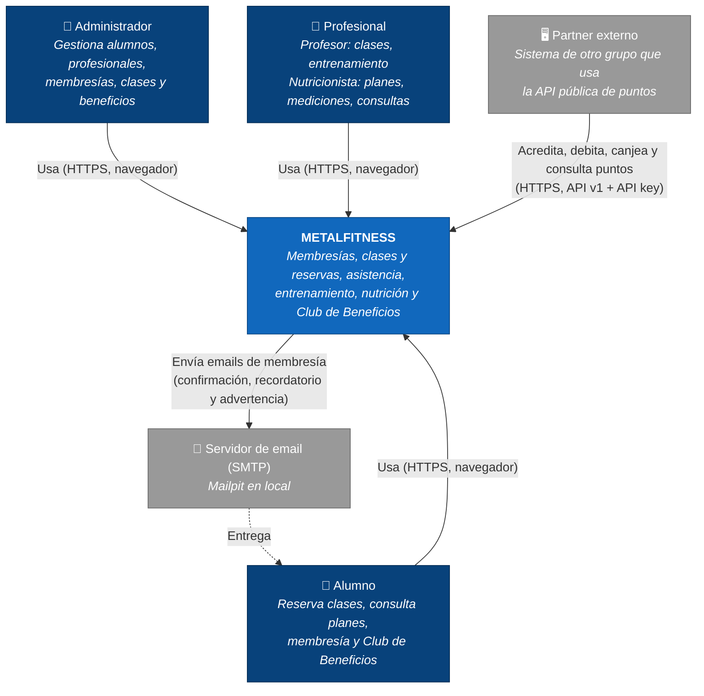
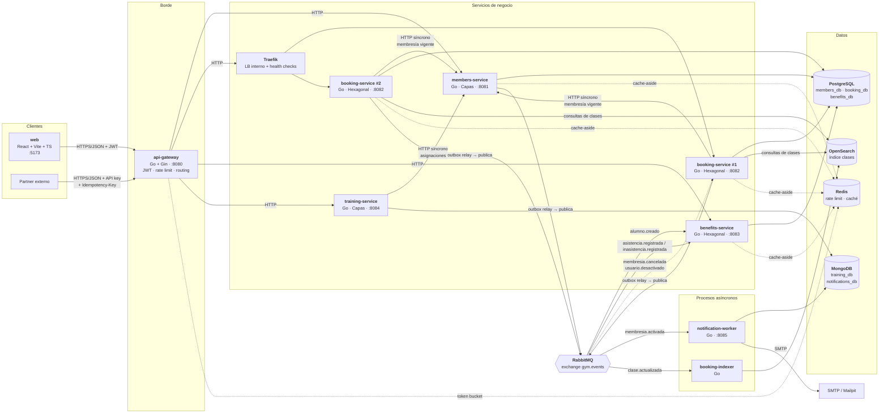

# Arquitectura — METALFITNESS

> Documento de referencia de la arquitectura del proyecto. La funcionalidad está definida en [SPEC.md](../SPEC.md); las decisiones estructurales están en [docs/adr/](adr/).
>
> - Versión: 1.4 (orden y atomicidad de movimientos de puntos)
> - Fecha: 2026-10-08
> - Incluye tres decisiones agregadas y aprobadas por el equipo (2026-10-07) para cubrir huecos con el SPEC: eventos `membresia.cancelada` y `usuario.desactivado`, consulta de asignaciones training → members y consulta de datos de alumnos booking → members. Registro completo en [Registro_de_Decisiones_Gimnasio.docx](../Registro_de_Decisiones_Gimnasio.docx) (D-20 a D-23).

---

## Índice

1. [Visión general](#1-visión-general)
2. [Diagrama C4 — Contexto](#2-diagrama-c4--contexto)
3. [Diagrama C4 — Contenedores](#3-diagrama-c4--contenedores)
4. [Servicios](#4-servicios)
5. [API Gateway](#5-api-gateway)
6. [Comunicaciones síncronas y asíncronas](#6-comunicaciones-síncronas-y-asíncronas)
7. [Catálogo inicial de eventos](#7-catálogo-inicial-de-eventos)
8. [Mensajería: topología, outbox e idempotencia](#8-mensajería-topología-outbox-e-idempotencia)
9. [Datos, caché y búsqueda](#9-datos-caché-y-búsqueda)
10. [Seguridad](#10-seguridad)
11. [Observabilidad](#11-observabilidad)
12. [Convenciones transversales](#12-convenciones-transversales)
13. [Estructura del monorepo](#13-estructura-del-monorepo)
14. [Distribución de componentes](#14-distribución-de-componentes)
15. [Limitaciones conocidas y deuda técnica](#15-limitaciones-conocidas-y-deuda-técnica)
16. [Índice de ADR](#16-índice-de-adr)

---

## 1. Visión general

El sistema se construye como un conjunto de **microservicios** organizados por **capacidad de negocio**, cada uno dueño de sus datos, detrás de un **API Gateway** propio que es el único punto de entrada del frontend y de los partners.

Este documento describe la **arquitectura objetivo** del sistema. Las tablas de responsabilidades, los diagramas y las secciones de seguridad, comunicación, datos y observabilidad expresan el estado que debe alcanzar el proyecto. La tabla siguiente separa ese diseño del esqueleto implementado hasta la entrega inicial.

| Estado | Componentes y comportamiento |
|---|---|
| **Implementado** | Módulos Go y ejecutables iniciales; health checks y readiness contra PostgreSQL/MongoDB; gateway con routing por prefijo, correlación, CORS, timeouts, errores y estado agregado; frontend de estado; bases y usuarios separados por servicio; contrato OpenAPI, guía y mock de partners. |
| **Desplegado, todavía sin integración funcional** | Redis y RabbitMQ están en Docker Compose con health checks, pero ningún flujo de negocio usa aún caché, rate limiting ni mensajería. |
| **Pendiente de implementación** | Casos de uso y persistencia de negocio; JWT e inyección de identidad; rate limiting; eventos, outbox, reintentos y DLQ; OpenSearch y CQRS; Traefik y segunda réplica de booking; SMTP/Mailpit; trazas, métricas, logs centralizados y tableros. |
| **Pendiente de definición externa** | Capacidad que METALFITNESS consumirá de otro grupo, su proveedor y el flujo relevante donde se integrará, según SPEC §1.5 y la futura decisión D9. |

Salvo que una sección indique expresamente el estado actual, sus descripciones deben leerse como decisiones y comportamiento **objetivo**, no como funcionalidad ya disponible.

| Aspecto | Decisión |
|---|---|
| Backend | Go 1.22+ con Gin |
| Frontend | React + Vite + TypeScript (SPA) |
| Entrada | `api-gateway` en Go: JWT, identidad, rate limiting, routing semántico, correlation ID, timeouts |
| Servicios de negocio | `members-service`, `booking-service` (×2 detrás de Traefik), `benefits-service`, `training-service` |
| Procesos de soporte | `booking-indexer` (CQRS de lectura), `notification-worker` (emails) |
| Persistencia | PostgreSQL (una instancia, una base por servicio) y MongoDB (training y notificaciones) |
| Mensajería | RabbitMQ, exchange topic `gym.events`, Transactional Outbox, consumidores idempotentes |
| Caché / búsqueda | Redis (cache-aside y rate limiting) / OpenSearch (lectura de clases) |
| Observabilidad | OpenTelemetry → OTel Collector → Jaeger (trazas), Prometheus (métricas), Loki (logs), Grafana |
| Ejecución | Docker Compose + Makefile (`make up`); CI con GitHub Actions |
| Pruebas | `go test` + testify + testcontainers-go; carga con k6 |

**Principios que guían el diseño**

1. **Un servicio, una capacidad, una base.** Ningún servicio lee ni escribe la base de otro (ADR-001, ADR-003).
2. **Las invariantes fuertes viven dentro de un servicio.** Cupo y reserva están juntos en `booking-service`; saldo y movimientos juntos en `benefits-service`. No hay transacciones distribuidas.
3. **Síncrono solo cuando la respuesta lo necesita** (verificar membresía vigente antes de reservar). La consulta es fresca, pero no forma una transacción distribuida; los cambios concurrentes convergen mediante eventos ([ADR-005 v2](adr/ADR-005-v2-comunicacion.md)).
4. **Entrega al menos una vez + consumo idempotente.** Outbox para publicar y deduplicación para lograr un único efecto durable en la base del consumidor. Los efectos externos no transaccionales, como SMTP, conservan sus propias limitaciones.
5. **El gateway es la frontera de confianza.** Los servicios confían en `X-User-Id` / `X-User-Role` porque solo el gateway puede llegar a ellos.

---

## 2. Diagrama C4 — Contexto

El diagrama representa el contexto objetivo. La capacidad externa que consumirá METALFITNESS se incorporará cuando se conozcan el proveedor y el flujo correspondiente.



---

## 3. Diagrama C4 — Contenedores

El diagrama representa la distribución objetivo de contenedores; la tabla de §1 indica qué partes están implementadas actualmente.



> Este es el diagrama objetivo. Observabilidad (OTel Collector, Jaeger, Prometheus, Loki y Grafana) se omite por claridad; cuando se implemente, los contenedores Go exportarán trazas, métricas y logs al OTel Collector (ver §11). La capacidad externa que consumirá METALFITNESS se agregará cuando se defina el proveedor y el flujo (SPEC §1.5).

---

## 4. Servicios

### 4.1 Tabla resumen

| Servicio | Responsabilidad | Entidades (SPEC §6) | Datos que administra | Almacenamiento | Patrón interno | Operaciones principales | Dependencias síncronas | Publica | Consume |
|---|---|---|---|---|---|---|---|---|---|
| **api-gateway** | Punto de entrada único. Autenticación JWT, identidad, rate limiting, routing, correlación, timeouts. | — | Ninguno de negocio. Contadores de rate limiting. | Redis | Pipeline de middlewares | Validar JWT, enrutar, limitar, propagar contexto | Todos los servicios (proxy) | — | — |
| **members-service** | Identidad y habilitación: usuarios, login, roles, alumnos, profesionales, asignaciones y membresías. | Usuario, Alumno, Profesional, AsignaciónProfesionalAlumno, TipoMembresía, Membresía | Padrón de personas, credenciales (hash), roles, asignaciones, historial de membresías | PostgreSQL `members_db` | **Capas** (Handler → Service → Repository) | Login (emite JWT), ABM de alumnos/profesionales, asignar alumno, asignar/renovar/cancelar membresía, vencimiento diario, avisos de vencimiento, consulta interna de vigencia | — | `alumno.creado`, `membresia.activada`, `membresia.recordatorio_vencimiento`, `membresia.advertencia_vencimiento`; `membresia.cancelada`, `usuario.desactivado` | — |
| **booking-service** | Oferta y uso del gimnasio: actividades, horarios, clases, reservas, ingresos y asistencia automática. | Actividad, Horario, Clase, Reserva, Asistencia | Catálogo de actividades, agenda, cupos, reservas, ingresos y asistencias | PostgreSQL `booking_db` (escritura, fuente de verdad) + OpenSearch (lectura) | **Hexagonal** + **CQRS de lectura** | Generar clases, consultar clases con ocupación, reservar, cancelar, registrar ingreso mediante DNI, marcar ausencias al finalizar, cancelar clase | `members-service` (membresía vigente; datos de alumnos para ingresos y listados) | `asistencia.registrada`, `clase.actualizada` | `membresia.cancelada`, `usuario.desactivado` |
| **booking-indexer** | Mantener el modelo de lectura de clases en OpenSearch. | Proyección `ClaseLectura` | Índice `clases` (derivado, reconstruible) | OpenSearch | Consumidor (parte del módulo booking) | Indexar/actualizar clase, reindexado completo | — (lee `booking_db` solo para reindexado completo, mismo servicio) | — | `clase.actualizada` |
| **benefits-service** | Club de Beneficios y **capacidad publicada a otros grupos** (API v1 de puntos). | CuentaBeneficios, MovimientoPuntos, Beneficio, Canje, Partner, VinculaciónPartner, OperaciónPartner | Cuentas, ledger inmutable, catálogo, canjes, partners y API keys (hash), claves de idempotencia | PostgreSQL `benefits_db` | **Hexagonal** | Consultar saldo/movimientos, canjear, acreditar por asistencia, penalizar inasistencia, revertir, ABM de beneficios y partners, API partner (acreditar, debitar, canjear, consultar) | `members-service` solo para validar el alumno al vincularlo a un partner (operación de baja frecuencia) | — (ninguno en v1) | `alumno.creado`, `asistencia.registrada`, `inasistencia.registrada` |
| **training-service** | Seguimiento del alumno: entrenamiento y nutrición. | PlanEntrenamiento, DíaRutina, EjercicioPlanificado, PlanAlimenticio, Medición, ConsultaNutricional | Planes (documentos anidados), mediciones (append-only), consultas | MongoDB `training_db` | **Capas** | ABM de planes de entrenamiento, planes alimenticios, registrar mediciones, consultas nutricionales | `members-service` (¿el alumno está asignado a este profesional?) | — | — |
| **notification-worker** | Enviar emails de membresía. | NotificaciónEmail | Registro de mensajes procesados y estado de envío | MongoDB `notifications_db` | Consumidor | Consumir eventos de confirmación, recordatorio y advertencia; enviar email; registrar resultado | SMTP (Mailpit en local) | — | `membresia.activada`, `membresia.recordatorio_vencimiento`, `membresia.advertencia_vencimiento` |

### 4.2 Detalle por servicio

#### members-service — Capas

- **Por qué capas:** sus flujos son mayormente altas, modificaciones y consultas con reglas acotadas (solapamiento de membresías, unicidad de DNI/email). La separación `handler → service → repository`, con interfaces requeridas por `service`, mantiene la lógica aislada de Gin y pgx sin incorporar todos los puertos y adaptadores explícitos del patrón hexagonal. Ver [ADR-002 v2](adr/ADR-002-v2-patrones-internos.md).
- **Reglas SPEC que implementa:** RN-01 a RN-06, RN-30 (parcial), RN-33, RN-34.
- **API interna** (no expuesta por el gateway): `GET /internal/v1/alumnos/{id}/vigencia?fechas=2026-10-07,2026-10-09` → `{vigente_hoy, vigente_en: {fecha: {vigente, membresia_id}}, evaluado_en}`; `GET /internal/v1/alumnos?ids=…` (datos mínimos para listados); `GET /internal/v1/asignaciones?profesional_id=…&alumno_id=…`.
- **Procesos programados:** generación diaria de avisos de vencimiento y vencimiento de membresías (America/Argentina/Buenos_Aires), además del relay del outbox.
- **JWT:** firma RS256 con clave privada propia; el gateway solo tiene la clave pública. Vida corta (15 min).

#### booking-service — Hexagonal + CQRS de lectura

- **Por qué hexagonal:** concentra las reglas más críticas del SPEC (RN-12 a RN-21, RN-38 a RN-40) y la concurrencia del cupo. El dominio puro permite probar las reglas sin infraestructura y cambiar adaptadores (Postgres, OpenSearch, cliente de members) sin tocarlas.
- **Puertos de salida:** `ClaseRepository`, `ReservaRepository`, `AsistenciaRepository`, `MembresiaChecker` (HTTP → members), `AlumnoDirectory` (HTTP → members), `EventPublisher` (outbox), `ClaseReadModel` (OpenSearch), `Clock`.
- **Puertos de entrada:** contratos de los casos de uso ofrecidos por `application`, por ejemplo reservar/cancelar una clase, registrar un ingreso y procesar hechos consumidos.
- **Adaptadores de entrada:** handlers HTTP con Gin y consumidores AMQP; traducen la interacción externa y llaman a los puertos de entrada.
- **CQRS de lectura:** las búsquedas de clases disponibles (`GET /clases?actividad=&fecha=`) se resuelven en OpenSearch; **toda escritura y toda validación** (cupo, duplicados, superposición) se hacen contra PostgreSQL. La ocupación mostrada en listados es eventualmente consistente; la reserva nunca lo es.
- **Concurrencia del cupo (RN-14):** actualización condicional atómica sobre la clase (`ocupacion < capacidad`) o bloqueo de fila, en la misma transacción que inserta la reserva. Restricciones únicas parciales para "una reserva CONFIRMADA por alumno y clase". Detalle en ADR-003.
- **Cancelaciones concurrentes de membresía:** cada reserva conserva `membresia_id`; booking registra las revocaciones consumidas. La creación de reservas y el consumidor se serializan con `pg_advisory_xact_lock` sobre esa membresía, conforme a ADR-005 v2.
- **2 instancias detrás de Traefik:** sin estado en memoria. Los procesos programados (marcar ausencias al finalizar clases, relay del outbox) se coordinan con `pg_advisory_lock` / `FOR UPDATE SKIP LOCKED` para no ejecutarse dos veces.
- **Binarios:** `cmd/api` (HTTP + consumidor) y `cmd/indexer` (booking-indexer). Mismo módulo, mismo dominio de lectura.

#### benefits-service — Hexagonal

- **Por qué hexagonal:** es la capacidad publicada a otros grupos; su contrato (API v1) debe mantenerse estable aunque cambie la infraestructura, y el ledger tiene invariantes estrictas (RN-22 a RN-27).
- **Ledger:** `movimientos_puntos` es append-only; todas las escrituras bloquean la fila de la cuenta y reciben una `account_sequence` creciente. El saldo se mantiene en `cuentas.saldo`, actualizado en la misma transacción que inserta el movimiento, con `CHECK (saldo >= 0)`. La reversión inserta un movimiento compensatorio. Ver [ADR-004](adr/ADR-004-orden-movimientos-puntos.md).
- **Cuentas:** el alta confirmada en `members-service` registra `alumno.creado` mediante outbox; `benefits-service` consume el evento y crea eventualmente una única cuenta con saldo 0. El alta no espera ni se revierte si benefits está caído. No se crean cuentas para personas que no sean alumnos; una vinculación o una operación posterior nunca crea una cuenta por sí sola.
- **API v1 de partners:** `/partner-api/v1/...` con API key (`X-API-Key`, guardada como hash) e `Idempotency-Key` obligatorio en escrituras. Contrato publicado: [docs/contracts/benefits-api.v1.yaml](contracts/benefits-api.v1.yaml) (OpenAPI 3.1, v1.0.0), guía para consumidores en [docs/contracts/README.md](contracts/README.md) y decisión en [ADR-008](adr/ADR-008-contrato-propio.md). Las rutas públicas son `/partner-api/v1/accounts/{externalUserId}/...` y usan inglés y `camelCase` (excepción a §12.2).
- **Idempotencia de asistencia e inasistencia:** restricciones únicas sobre `movimientos_puntos.origen_asistencia_id` y `movimientos_puntos.origen_reserva_id` además del registro de mensajes procesados. La penalización se calcula como `min(100, saldo_actual)` bajo el bloqueo de la cuenta; con saldo 0 se registra un movimiento de 0 para cerrar el efecto de forma auditable.

#### training-service — Capas

- **Por qué capas:** operaciones de alta y consulta de documentos con reglas acotadas y sin concurrencia crítica. `service` conserva las reglas y depende de interfaces implementadas por `repository`, por lo que el patrón no obliga a acoplar la lógica a MongoDB.
- **Por qué MongoDB:** un plan de entrenamiento es un agregado jerárquico (plan → días → ejercicios) que se lee y escribe completo; las mediciones son append-only y se consultan por alumno y fecha. Ver ADR-003.
- **Colecciones:** `planes_entrenamiento`, `planes_alimenticios`, `mediciones`, `consultas_nutricionales`.

#### notification-worker

- Consume eventos de membresía, arma el email correspondiente con los datos que trae el evento (no consulta a members) y lo envía por SMTP. Los eventos de recordatorio y advertencia incluyen una clave única por membresía y tipo para evitar duplicados.
- Registra en `notifications_db.mensajes` cada `event_id` con estado `PROCESANDO → ENVIADO | FALLIDO`; índice único por `event_id`.
- La deduplicación garantiza una única notificación lógica. SMTP no permite atomicidad entre enviar y guardar `ENVIADO`: una caída en esa ventana puede producir un email duplicado al reintentar ([ADR-005 v2](adr/ADR-005-v2-comunicacion.md)).
- Expone `:8085` solo para `/health` y `/metrics`.

---

## 5. API Gateway

### 5.1 Pipeline de middlewares (en orden)

| # | Middleware | Comportamiento |
|---|---|---|
| 1 | Recovery + access log | Nunca cae por un pánico; log estructurado de cada request. |
| 2 | Correlation ID | Toma `X-Correlation-ID` si viene y es válido (8 a 128 caracteres `[A-Za-z0-9._:-]`); si no, genera un UUID v4. Lo propaga a los servicios y lo devuelve en la respuesta. |
| 3 | Trazas OTel | Abre el span raíz y propaga `traceparent` (W3C). |
| 4 | **Limpieza de identidad** | Borra **siempre** `X-User-Id`, `X-User-Role`, `X-Partner-Id` y cualquier `X-Internal-*` que mande el cliente. |
| 5 | Autenticación | Rutas `/api/v1/**` (salvo login): valida JWT RS256 (firma, `exp`, `iss`, `aud`). Rutas `/partner-api/v1/**`: exige `X-API-Key` presente (la validación la hace benefits-service, dueño de los partners). |
| 6 | Inyección de identidad | Desde el JWT: `X-User-Id` = `sub`, `X-User-Role` ∈ {`ADMINISTRADOR`, `PROFESOR`, `NUTRICIONISTA`, `ALUMNO`}. |
| 7 | Rate limiting | Token bucket en Redis (script atómico). Clave por usuario (`sub`), por API key (hash) o por IP (login). Excedido → `429` con `Retry-After` y problema RFC 7807. |
| 8 | Routing semántico | Por prefijo de recurso (ver 5.2). Rutas `/internal/**` → `404` (nunca se exponen). |
| 9 | Timeout por ruta | `context.WithTimeout` por ruta; vencido → `504` RFC 7807. |

### 5.2 Tabla de routing

Los prefijos públicos de recurso van en **inglés** (decisión de la etapa de esqueleto, para alinear con las consignas del TP); el dominio, el código y los campos JSON siguen la convención de §12.2. Cada prefijo cubre la ruta exacta y todo lo que cuelga de ella (`/api/v1/bookings` y `/api/v1/bookings/…`). El timeout de cada ruta se configura con `GATEWAY_TIMEOUT_<CLAVE>` (por defecto `GATEWAY_TIMEOUT_DEFAULT`, 3 s).

| Prefijo público | Destino | Clave de timeout | Timeout inicial | Rate limit previsto |
|---|---|---|---|---|
| `/api/v1/auth` | members-service | `AUTH` | 3 s | 5 req/min por IP (login) |
| `/api/v1/users` | members-service | `USERS` | 3 s | 10 req/s, ráfaga 20, por usuario |
| `/api/v1/memberships` | members-service | `MEMBERSHIPS` | 3 s | ídem |
| `/api/v1/activities` | booking-service | `ACTIVITIES` | 3 s | ídem |
| `/api/v1/classes` | booking-service | `CLASSES` | 3 s | ídem |
| `/api/v1/bookings` | booking-service | `BOOKINGS` | 5 s | ídem |
| `/api/v1/check-ins` | booking-service | `CHECK_INS` | 5 s | ídem |
| `/api/v1/benefits` | benefits-service | `BENEFITS` | 5 s | ídem |
| `/api/v1/training` | training-service | `TRAINING` | 3 s | ídem |
| `/api/v1/nutrition` | training-service | `NUTRITION` | 3 s | ídem |
| `/partner-api/v1` | benefits-service | `PARTNER_API` | 5 s | 20 req/s, ráfaga 40, por API key |

Endpoints propios del gateway: `GET /api/v1/status` (resumen del `/health/ready` de cada servicio, ver §12.3), `GET /health/live` y `GET /health/ready`. Cualquier ruta con un segmento `internal` responde `404`, también después de normalizar `..` y `%2e%2e`. Una ruta sin prefijo conocido responde `404 NO_ENCONTRADO`; un servicio caído, `502 DEPENDENCIA_NO_DISPONIBLE`; un timeout, `504 TIMEOUT`.

Los sub-recursos de cada prefijo (ej. `/api/v1/users/{id}/assignments`, `/api/v1/benefits/redemptions`) se definen en la etapa de cada servicio. Los valores de timeout y rate limit son iniciales; se ajustan con las pruebas de carga (k6).

### 5.3 Comportamiento ante fallas de Redis

El rate limiting **falla abierto** (deja pasar y registra métrica `ratelimit_redis_errors_total`): preferimos disponibilidad del gimnasio a protección estricta ante una caída de Redis. Login es la excepción: **falla cerrado** (protección contra fuerza bruta).

---

## 6. Comunicaciones síncronas y asíncronas

### 6.1 Síncronas (HTTP/JSON)

| Origen | Destino | Operación | Motivo de ser síncrona | Timeout | Reintentos | Si falla |
|---|---|---|---|---|---|---|
| web | api-gateway | Toda la API pública | Interacción de usuario | Según §5.2 | No (el cliente reintenta con la misma `Idempotency-Key`) | Error RFC 7807 |
| Partner | api-gateway → benefits | API v1 de puntos | Contrato público request/response | 5 s | El partner, con la misma `Idempotency-Key` | RFC 7807 |
| api-gateway | Servicios | Proxy | — | Según ruta | No (no conoce idempotencia de cada operación) | `502`/`504` RFC 7807 |
| booking | members | Membresía vigente hoy y en la fecha de la clase (RN-12 b) | La reserva **no puede** confirmarse sin la respuesta | 800 ms | 1 reintento (GET idempotente) con backoff 100 ms + circuit breaker | **Falla cerrado:** `503 MEMBERS_NO_DISPONIBLE`; no se reserva |
| booking | members | Datos mínimos de alumnos para listados del profesor | Composición de vistas | 800 ms | 1 | Se devuelve el listado con IDs sin nombre (degradación) |
| training | members | ¿Alumno asignado al profesional? (RN-30) | Autorización | 800 ms | 1 + caché Redis 60 s | Falla cerrado: `503` |
| benefits | members | Validar alumno al vincularlo a un partner | Validación de alta | 800 ms | 1 | `503`; el admin reintenta |
| notification-worker | SMTP | Envío de email | Protocolo SMTP | 10 s | Vía colas de reintento | Reintento → DLQ |

La validación booking → members usa datos frescos, pero no es una transacción entre servicios. Members devuelve la membresía que cubre la fecha de la clase y booking la guarda con la reserva. La creación de la reserva y el consumo de `membresia.cancelada` usan el mismo bloqueo transaccional por `membresia_id` dentro de booking: el consumidor registra una revocación durable y cancela las reservas afectadas, o la inserción posterior detecta la revocación y se rechaza. El estado converge aunque una reserva pueda quedar confirmada transitoriamente durante la propagación. Ver [ADR-005 v2](adr/ADR-005-v2-comunicacion.md).

### 6.2 Asíncronas (RabbitMQ, exchange `gym.events`)

| Evento | Productor | Consumidor(es) | Efecto en el consumidor | Reglas SPEC |
|---|---|---|---|---|
| `alumno.creado` | members-service | benefits-service | Crear la cuenta de beneficios del alumno con saldo 0 | S-10, HU-01 |
| `membresia.activada` | members-service | notification-worker | Enviar email de confirmación (asignación o renovación) | RN-05 |
| `membresia.recordatorio_vencimiento` | members-service | notification-worker | Enviar recordatorio 10 días antes del vencimiento | RN-41 |
| `membresia.advertencia_vencimiento` | members-service | notification-worker | Enviar advertencia el día del vencimiento | RN-41 |
| `asistencia.registrada` | booking-service | benefits-service | Acreditar +500 puntos por ingreso válido exactamente una vez | RN-20, RN-21 |
| `inasistencia.registrada` | booking-service | benefits-service | Aplicar hasta -100 puntos por reserva confirmada no asistida, sin saldo negativo y exactamente una vez | RN-38 |
| `clase.actualizada` | booking-service | booking-indexer | Upsert del documento de la clase en OpenSearch (ignora versiones viejas) | CQRS |
| `membresia.cancelada` | members-service | booking-service | Cancelar reservas futuras no cubiertas por otra membresía vigente | RN-04 |
| `usuario.desactivado` | members-service | booking-service | Cancelar reservas futuras del alumno dado de baja | RN-34 |

---

## 7. Catálogo inicial de eventos

### 7.1 Sobre común (envelope)

Todos los eventos viajan con la misma envoltura JSON. La routing key es el nombre del evento.

| Campo | Tipo | Descripción |
|---|---|---|
| `event_id` | UUID | Identificador único; clave de idempotencia del consumidor |
| `event_type` | string | Nombre, ej. `asistencia.registrada` |
| `event_version` | int | Versión del esquema de `data` (empieza en 1) |
| `occurred_at` | RFC 3339 UTC | Momento del hecho de negocio |
| `producer` | string | Servicio productor, ej. `booking-service` |
| `correlation_id` | string | Correlation ID de la request que originó el hecho |
| `traceparent` | string | Contexto W3C para continuar la traza |
| `data` | objeto | Contenido específico del evento |

**Reglas de versionado:** agregar campos opcionales no cambia la versión. Quitar, renombrar o cambiar el tipo de un campo exige `event_version + 1` y publicar ambas versiones mientras haya consumidores de la anterior. Los consumidores ignoran campos desconocidos.

### 7.2 Eventos

| Evento | Versión | Productor | Consumidores | Campos de `data` |
|---|---|---|---|---|
| `membresia.activada` | 1 | members-service | notification-worker | `membresia_id`, `alumno_id`, `alumno_nombre`, `alumno_email`, `tipo_membresia`, `fecha_inicio` (fecha), `fecha_vencimiento` (fecha), `operacion` (`ASIGNACION` \| `RENOVACION`), `membresia_anterior_id` (nullable) |
| `membresia.recordatorio_vencimiento` | 1 | members-service | notification-worker | `membresia_id`, `alumno_id`, `alumno_nombre`, `alumno_email`, `tipo_membresia`, `fecha_vencimiento`, `dias_restantes` (10), `clave_notificacion` |
| `membresia.advertencia_vencimiento` | 1 | members-service | notification-worker | `membresia_id`, `alumno_id`, `alumno_nombre`, `alumno_email`, `tipo_membresia`, `fecha_vencimiento`, `dias_restantes` (0), `clave_notificacion` |
| `alumno.creado` | 1 | members-service | benefits-service | `alumno_id` |
| `asistencia.registrada` | 1 | booking-service | benefits-service | `asistencia_id`, `reserva_id`, `clase_id`, `alumno_id`, `actividad_id`, `actividad_nombre`, `clase_inicio` (RFC 3339), `resultado` (`ASISTIO`), `puntos` (500), `origen` (`INGRESO_DNI`), `registrada_en` |
| `inasistencia.registrada` | 1 | booking-service | benefits-service | `reserva_id`, `clase_id`, `alumno_id`, `actividad_id`, `clase_inicio` (RFC 3339), `puntos_penalizacion` (100), `registrada_en` |
| `clase.actualizada` | 1 | booking-service | booking-indexer | `clase_id`, `version` (int creciente por clase), `actividad_id`, `actividad_nombre`, `fecha`, `inicio`, `fin`, `franja` (nullable, solo Musculación), `profesor_id`, `profesor_nombre`, `capacidad`, `ocupacion`, `estado` (`PROGRAMADA` \| `EN_CURSO` \| `FINALIZADA` \| `CANCELADA`) |
| `membresia.cancelada` | 1 | members-service | booking-service | `membresia_id`, `alumno_id`, `fecha_inicio`, `fecha_vencimiento`, `motivo`, `cancelada_en` |
| `usuario.desactivado` | 1 | members-service | booking-service | `usuario_id`, `rol`, `desactivado_en` |

Notas:
- `membresia.activada` lleva nombre y email (**event-carried state transfer**) para que el worker no dependa de members-service. Es dato personal: el worker no lo registra en logs.
- `asistencia.registrada` solo se publica para ingresos válidos y dispara +500 puntos. `inasistencia.registrada` se publica al cerrar la clase para aplicar hasta -100 puntos; ambos eventos se consumen idempotentemente.
- Benefits no presupone orden entre esos eventos: los serializa por cuenta y asigna una secuencia al confirmarlos. `occurred_at` conserva el momento del hecho, pero no reordena el ledger (ADR-004).
- `clase.actualizada` se publica en **cada** cambio que afecte la vista: alta, cambio de capacidad/responsable, cancelación, y cada reserva o cancelación (cambia `ocupacion`). El campo `version` permite descartar mensajes fuera de orden.
- Los esquemas JSON formales vivirán en `docs/events/` (etapa siguiente).

---

## 8. Mensajería: topología, outbox e idempotencia

### 8.1 Topología RabbitMQ

| Elemento | Nombre | Tipo / binding |
|---|---|---|
| Exchange principal | `gym.events` | topic, durable |
| Exchange de reintentos | `gym.retry` | direct, durable |
| Exchange de DLQ | `gym.dlx` | direct, durable |
| Cola por consumidor | `<consumidor>.<evento>` ej. `benefits.asistencia-registrada` | durable, quorum; binding `asistencia.registrada` |
| Colas de reintento | `<cola>.retry.10s`, `<cola>.retry.1m`, `<cola>.retry.10m` | TTL fijo + dead-letter de vuelta a `gym.events` con la routing key original |
| DLQ | `<cola>.dlq` | durable; revisión manual y re-publicación con herramienta del Makefile |

Colas iniciales: `notification.membresia-activada`, `benefits.asistencia-registrada`, `benefits.inasistencia-registrada`, `booking-indexer.clase-actualizada` y, si se aprueban, `booking.membresia-cancelada`, `booking.usuario-desactivado`.

**Política de reintento:** error transitorio → se publica a la cola de reintento correspondiente al número de intento (header `x-attempt`), luego ACK del original. Tras 4 intentos fallidos o ante un error permanente (mensaje inválido, versión desconocida) → DLQ.

### 8.2 Transactional Outbox

1. El caso de uso escribe el cambio de negocio **y** una fila en `outbox` (mismo esquema, misma transacción).
2. Un **relay de polling** (goroutine dentro del servicio) lee cada 500 ms hasta 100 filas pendientes con `FOR UPDATE SKIP LOCKED`, publica con **publisher confirms** y marca `published_at`.
3. Con 2 instancias de booking, `SKIP LOCKED` evita que ambas publiquen la misma fila al mismo tiempo; aun así la entrega es **al menos una vez**.
4. Filas publicadas se purgan pasados 7 días.

Servicios con outbox: `members-service`, `booking-service`. (benefits y training no publican en v1.)

### 8.3 Consumidores idempotentes

- Cada consumidor registra el `event_id` procesado **en la misma transacción que el efecto** (tabla `processed_messages` en Postgres; colección con índice único en Mongo).
- Además, restricciones de negocio actúan como segunda barrera (ej. único `origen_asistencia_id` en el ledger).
- **ACK después del efecto.** Si el proceso muere antes del ACK, el mensaje se reentrega y se descarta por duplicado.
- `prefetch` acotado (10) para no acaparar mensajes.
- En benefits, todos los consumidores y endpoints que afectan saldo bloquean la misma fila de cuenta; así comparten un único orden de aplicación con créditos, débitos, canjes y reversiones HTTP.

### 8.4 Idempotencia de requests HTTP

| Ámbito | Header | Obligatoria | Retención | Dónde se guarda |
|---|---|---|---|---|
| Frontend: reservar, cancelar, canjear, registrar ingreso | `Idempotency-Key` | Recomendada (la envía el frontend siempre) | 24 h | Tabla `idempotency_keys` del servicio dueño |
| Partners: acreditar, debitar, canjear | `Idempotency-Key` | **Obligatoria** | ≥ 30 días (RN-27) | `operaciones_partner` en `benefits_db` |

Misma clave + mismo hash de request → misma respuesta guardada. Misma clave + otro hash → `409 CONFLICTO_IDEMPOTENCIA`. Request en curso con la misma clave → `409 OPERACION_EN_CURSO` (reintentable).

---

## 9. Datos, caché y búsqueda

| Almacén | Bases / índices | Dueño | Uso |
|---|---|---|---|
| PostgreSQL 16 (1 instancia local) | `members_db`, `booking_db`, `benefits_db` | Un usuario de base por servicio, con permisos **solo** sobre su base | Fuente de verdad transaccional |
| MongoDB 7 | `training_db`, `notifications_db` | training-service / notification-worker | Documentos jerárquicos y registros de procesamiento |
| Redis 7 | Prefijos por servicio: `gw:rl:*`, `members:*`, `booking:*`, `benefits:*` | Cada servicio solo usa su prefijo | Rate limiting y cache-aside |
| OpenSearch 2 | Índice `clases` (alias `clases-read`) | booking-service | Modelo de lectura de clases disponibles |

**Cache-aside inicial:**

| Clave | Servicio | TTL | Invalidación |
|---|---|---|---|
| Catálogo de actividades | booking | 10 min | Al modificar una actividad |
| Catálogo de beneficios | benefits | 5 min | Al modificar un beneficio |
| Tipos de membresía | members | 1 h | Al modificar un tipo |
| Asignaciones profesional–alumno | training | 60 s | Solo TTL |

**No se cachea** la vigencia de membresía al reservar: es una validación de negocio (RN-12) y un valor viejo podría permitir reservar con una membresía recién cancelada.

Detalle y justificación en [ADR-003](adr/ADR-003-persistencia.md).

---

## 10. Seguridad

| Tema | Decisión |
|---|---|
| Autenticación de usuarios | Login en members-service; JWT RS256 (15 min) con `sub`, `role`, `iss=gym-members`, `aud=gym-api`. Sin refresh token en v1 (el usuario vuelve a loguearse). |
| Autorización | Gruesa en el gateway (rol por ruta) y **fina en cada servicio** (ej. "solo el administrador", "solo su propia reserva"). El ingreso por DNI valida identidad y membresía en booking/members, no usa un rol de profesor. |
| Confianza interna | Los servicios aceptan `X-User-Id`/`X-User-Role` porque **solo** son alcanzables desde la red interna de Docker; sus puertos no se publican en el host salvo en modo desarrollo. |
| Partners | API key por partner (se muestra una sola vez, se guarda hash SHA-256), validada por benefits-service. Rate limit por key. |
| Contraseñas | Hash con bcrypt (costo ≥ 12). |
| Secretos | Variables de entorno; `.env.example` versionado, `.env` nunca. |
| Datos personales | No se loguean emails, DNI, tokens ni API keys. |

---

## 11. Observabilidad

| Señal | Instrumentación | Pipeline | Visualización |
|---|---|---|---|
| Trazas | OTel SDK Go (`otelgin`, `otelhttp`, instrumentación manual en publicación/consumo AMQP y SQL) | OTLP → OTel Collector → Jaeger | Jaeger UI y Grafana |
| Métricas | OTel SDK (RED por endpoint, latencia de dependencias, tamaño de outbox pendiente, mensajes en DLQ, reintentos) | OTLP → Collector → Prometheus | Grafana |
| Logs | `log/slog` en JSON a stdout con `trace_id`, `span_id`, `correlation_id` | Collector (filelog / Docker) → Loki | Grafana (enlace log ↔ traza) |

La traza atraviesa la frontera asíncrona: el productor guarda `traceparent` en el outbox y el consumidor continúa la traza desde el envelope.

**Dashboards iniciales:** salud por servicio (RED), reservas (aceptadas/rechazadas por motivo), outbox (pendientes, antigüedad), mensajería (lag por cola, DLQ), API de partners (requests, 4xx/5xx, idempotencia).

---

## 12. Convenciones transversales

### 12.1 Errores — RFC 7807 (`application/problem+json`)

```json
{
  "type": "https://gym.local/problems/sin-cupo",
  "title": "Sin cupo",
  "status": 409,
  "detail": "La clase 3f1c… no tiene lugares disponibles.",
  "instance": "/api/v1/reservas",
  "code": "SIN_CUPO",
  "correlation_id": "6b1e…"
}
```

| `code` | HTTP | Regla SPEC |
|---|---|---|
| `VALIDACION` | 400 | §9 |
| `NO_AUTENTICADO` / `SIN_PERMISO` | 401 / 403 | RN-30 |
| `NO_ENCONTRADO` / `CUENTA_NO_ENCONTRADA` | 404 | RN-26 |
| `MEMBRESIA_NO_VIGENTE` | 422 | RN-12 |
| `CLASE_NO_FUTURA` / `CLASE_CANCELADA` | 422 | RN-12 |
| `SIN_CUPO` | 409 | RN-14 |
| `RESERVA_DUPLICADA` | 409 | RN-13 |
| `TURNO_MUSCULACION_DIARIO` | 409 | RN-39 |
| `SUPERPOSICION_RESERVA` | 409 | RN-40 |
| `PLAZO_CANCELACION_VENCIDO` | 422 | RN-17 |
| `VENTANA_ASISTENCIA_CERRADA` | 422 | RN-19 |
| `ASISTENCIA_YA_REGISTRADA` | 409 | RN-21 |
| `TRANSICION_INVALIDA` | 409 | §7 |
| `SOLAPAMIENTO_MEMBRESIA` | 409 | RN-02 |
| `SALDO_INSUFICIENTE` | 422 | RN-23 |
| `BENEFICIO_NO_DISPONIBLE` | 422 | RN-24 |
| `CONFLICTO_IDEMPOTENCIA` / `OPERACION_EN_CURSO` | 409 | RN-15, RN-27 |
| `METODO_NO_PERMITIDO` | 405 | Infraestructura (router común) |
| `LIMITE_EXCEDIDO` | 429 | Gateway |
| `ERROR_INTERNO` | 500 | Infraestructura (pánico recuperado; nunca expone detalles) |
| `DEPENDENCIA_NO_DISPONIBLE` | 502 (gateway → servicio) / 503 (servicio → dependencia) | §6.1 |
| `TIMEOUT` | 504 | Gateway |

Implementación común: `pkg/problem`. Los errores de la API pública de partners usan su propio catálogo en inglés (ADR-008).

### 12.2 Nombres

| Elemento | Convención | Ejemplo |
|---|---|---|
| Términos de dominio | Español, según el glosario del SPEC, sin tildes en identificadores | `Reserva`, `Membresia`, `CuentaBeneficios` |
| Términos técnicos | Inglés | `Repository`, `Handler`, `Publisher` |
| Endpoints públicos | `/api/v1/<recurso-plural>` en inglés, kebab-case (ver §5.2) | `/api/v1/bookings` |
| Endpoints internos | `/internal/v1/<recurso>`; el gateway nunca los expone | `/internal/v1/alumnos/{id}/vigencia` |
| Header de correlación | `X-Correlation-ID` | — |
| JSON | snake_case | `fecha_vencimiento` |
| Eventos | `<entidad>.<participio>` en minúscula | `asistencia.registrada` |
| Tablas / colecciones | snake_case plural | `movimientos_puntos` |
| Variables de entorno | `UPPER_SNAKE`, prefijo del servicio | `BOOKING_DB_DSN` |
| Fechas y horas | RFC 3339 en UTC en APIs/eventos; reglas de negocio evaluadas en America/Argentina/Buenos_Aires | `2026-10-07T22:00:00Z` |

### 12.3 Endpoints comunes de todo servicio

Todo proceso Go (servicios, indexer, worker y gateway) expone:

| Endpoint | Responde | Uso |
|---|---|---|
| `GET /health/live` | `200 {"status":"alive","checks":{}}` mientras el proceso atienda | Liveness |
| `GET /health/ready` | `200` si todas sus dependencias propias responden; si alguna falla, `503` con el detalle por dependencia | Readiness, healthcheck de Docker Compose y `/api/v1/status` |
| `GET /metrics` | *(etapa de observabilidad)* | Prometheus |

Cuerpo de `/health/ready` (implementado en `pkg/health`; es un informe de estado, no un error RFC 7807):

```json
{ "status": "not_ready", "checks": { "postgres": { "status": "down", "latency_ms": 2000, "error": "timeout" } } }
```

| Proceso | Dependencias verificadas en `/health/ready` |
|---|---|
| members-service, booking-service, booking-indexer, benefits-service | PostgreSQL (su propia base) |
| training-service, notification-worker | MongoDB (su propia base) |
| api-gateway | Ninguna (su estado agregado está en `/api/v1/status`) |

`GET /api/v1/status` (gateway) consulta en paralelo el `/health/ready` de cada proceso y devuelve `200` si todos están `ready` o `503` si alguno no lo está:

```json
{
  "status": "ready",
  "checked_at": "2026-10-07T20:00:00Z",
  "services": [
    { "name": "members-service", "status": "ready", "latency_ms": 3, "checks": { "postgres": "up" } }
  ]
}
```

Estados por servicio: `ready`, `not_ready` (respondió 503) o `unreachable` (no respondió). Por ser un endpoint público, **no** reenvía los mensajes de error internos de cada dependencia.

---

## 13. Estructura del monorepo

```text
/
├── SPEC.md                         # Especificación funcional (fuente de verdad del negocio)
├── README.md
├── CONTRIBUTING.md
├── CLAUDE.md
├── Makefile                        # make up | down | logs | ps | test | lint | fmt | tidy | mock-up | contract-lint
├── go.work                         # Workspace Go: un módulo por servicio + gateway + pkg
├── .env.example                    # Variables del stack local (cp .env.example .env)
├── .golangci.yml                   # golangci-lint v2, compartido
├── .github/
│   └── workflows/                  # ci.yml (vet, golangci-lint, tests, build web) y contract.yml
├── gateway/                        # api-gateway (módulo Go propio)
│   ├── cmd/gateway/
│   ├── internal/{config,proxy,status,middleware,server}/
│   └── Dockerfile
├── services/
│   ├── members-service/            # CAPAS
│   │   ├── cmd/api/
│   │   ├── internal/{config,handler,service,repository,model}/
│   │   ├── migrations/             # (etapa de usuarios)
│   │   └── Dockerfile
│   ├── booking-service/            # HEXAGONAL + CQRS
│   │   ├── cmd/{api,indexer}/
│   │   ├── internal/
│   │   │   ├── config/
│   │   │   ├── domain/             # entidades, value objects, reglas, errores (solo stdlib, sin tags)
│   │   │   ├── application/        # casos de uso + puertos de ENTRADA
│   │   │   ├── ports/              # puertos de SALIDA (repositorios, members, outbox, reloj…)
│   │   │   └── adapters/{http,postgres,…}/   # amqp, opensearch, members, outbox a medida que se necesiten
│   │   ├── migrations/             # (etapa de clases y reservas)
│   │   └── Dockerfile              # una imagen con los binarios booking-service y booking-indexer
│   ├── benefits-service/           # HEXAGONAL (misma forma que booking, sin indexer)
│   ├── training-service/           # CAPAS (repository sobre MongoDB)
│   └── notification-worker/
│       ├── cmd/worker/
│       └── internal/{config,consumer,mailer,store}/
├── pkg/                            # Librerías técnicas compartidas (NUNCA lógica de dominio)
│   ├── config/                     # lectura de variables de entorno con errores acumulados
│   ├── logger/                     # slog JSON con service y correlation_id
│   ├── correlation/                # X-Correlation-ID: middleware, context y propagación saliente
│   ├── problem/                    # RFC 7807
│   ├── health/                     # /health/live y /health/ready
│   ├── httpx/                      # router Gin base (correlation, access log, recovery, 404/405)
│   └── httpserver/                 # servidor HTTP con graceful shutdown
│                                   # (más adelante: events, outbox, idempotency, httpclient, observability)
├── web/                            # React + Vite + TypeScript (nginx en el contenedor)
├── deploy/
│   ├── docker-compose.yml          # stack local completo
│   ├── docker-compose.mock.yml     # solo el mock de Prism del contrato de partners
│   ├── postgres/init/              # crea members_db, booking_db, benefits_db con un usuario cada una
│   ├── mongo/init/                 # crea un usuario por base (training_db, notifications_db)
│   └── …                           # (más adelante: rabbitmq/, traefik/, opensearch/, observability/)
├── docs/
│   ├── ARCHITECTURE.md
│   ├── adr/
│   ├── api/                        # OpenAPI interno por servicio
│   ├── contracts/                  # Contratos públicos: benefits-api.v1.yaml + guía + reglas Spectral
│   └── events/                     # JSON Schema de cada evento
└── tests/
    ├── load/                       # scripts k6
    └── e2e/                        # flujos E2E del SPEC §11 contra el stack levantado
```

**Módulos Go:** un `go.mod` por servicio, por `gateway/` y por `pkg/`, unidos con `go.work`. Cada `go.mod` de servicio referencia `pkg` con `replace ../../pkg`, así la imagen Docker compila sin `go.work`. Un servicio no puede importar `internal/` de otro. El patrón de cada servicio está en [ADR-002](adr/ADR-002-patrones-internos.md).

---

## 14. Distribución de componentes

### 14.1 Local (Docker Compose, `make up`)

`deploy/docker-compose.yml`, con las variables de `.env` (copia de `.env.example`). Todos los contenedores tienen healthcheck y cada uno espera a sus dependencias con `depends_on: condition: service_healthy`; `make up` usa `--wait` y termina cuando todo está *healthy*. Solo el gateway (8080) y el web (5173) se publican en todas las interfaces; el resto se publica en `127.0.0.1` para depurar.

| Contenedor | Imagen / build | Puerto host | Réplicas | ¿En el compose? |
|---|---|---|---|---|
| `web` | build `web/`: Vite compila estáticos, nginx los sirve | 5173 | 1 | Sí |
| `api-gateway` | build `gateway/` | 8080 | 1 | Sí |
| `members-service` | build | 127.0.0.1:8081 | 1 | Sí |
| `booking-service` | build | 127.0.0.1:8082 | 1 (2 detrás de Traefik más adelante) | Sí |
| `booking-indexer` | misma imagen que booking, entrypoint `/app/booking-indexer` | 127.0.0.1:8086 (health) | 1 | Sí (esqueleto) |
| `benefits-service` | build | 127.0.0.1:8083 | 1 | Sí |
| `training-service` | build | 127.0.0.1:8084 | 1 | Sí |
| `notification-worker` | build | 127.0.0.1:8085 (health) | 1 | Sí (esqueleto) |
| `postgres` | postgres:16-alpine | 127.0.0.1:5432 | 1 (3 bases, 3 usuarios) | Sí |
| `mongo` | mongo:7 (standalone con usuarios por base) | 127.0.0.1:27017 | 1 | Sí |
| `redis` | redis:7-alpine (con contraseña) | 127.0.0.1:6379 | 1 | Sí (lo usará el rate limiting) |
| `rabbitmq` | rabbitmq:3-management | 127.0.0.1:5672 / 15672 | 1 | Sí (lo usarán los eventos) |
| `benefits-mock` | stoplight/prism:5.15.10 (contrato de partners) | 4010 | 1 | Sí |
| `traefik` | traefik v3 | — | 1 | No, etapa de balanceo |
| `opensearch` | opensearch 2.x | — | 1 | No, etapa de CQRS |
| `mailpit` | axllent/mailpit | — | 1 | No, etapa de notificaciones |
| `otel-collector`, `jaeger`, `prometheus`, `loki`, `grafana` | oficiales | — | 1 c/u | No, etapa de observabilidad |

Requisitos: ~8 GB de RAM y **al menos 15 GB libres en disco** para imágenes y builds cuando el stack esté completo (hoy, con el esqueleto, alrededor de 6 GB).

### 14.2 Nube

El requisito externo es que **otros grupos puedan consumir la API v1 de puntos**.

**Decisión:** se despliega **el stack completo en una VM con Docker Compose**, igual que en local, con perfil `prod`: el frontend se sirve como estáticos (sin el servidor de desarrollo de Vite) y Traefik actúa además como borde HTTPS. El **proveedor de nube no está elegido**; se definirá en un ADR posterior.

| Aspecto | Detalle |
|---|---|
| Qué se expone a Internet | Solo el gateway (HTTPS): `/api/v1/**` para el frontend y `/partner-api/v1/**` para los partners |
| Qué queda privado | Servicios, bases, broker, Redis, OpenSearch y la observabilidad (acceso por túnel SSH) |
| Por qué | Paridad total con local, costo bajo y operación simple para un TP; las acreditaciones por asistencia funcionan porque booking también está desplegado |
| Alternativa descartada | Desplegar solo gateway + benefits: alcanza para los partners, pero los puntos por asistencia nunca llegarían |

---

## 15. Limitaciones conocidas y deuda técnica

| # | Limitación | Impacto | Mitigación prevista |
|---|---|---|---|
| L-01 | **Una sola instancia de PostgreSQL** para tres bases. | Punto único de falla y recursos compartidos; aislamiento lógico, no físico. | Usuarios y permisos por base; ninguna consulta cruzada. Separar instancias es cambiar DSN. |
| L-02 | **Dependencia síncrona booking → members** para reservar y carrera con una cancelación concurrente. | Si members cae, no se reserva. Una reserva puede confirmarse transitoriamente mientras se propaga una cancelación. | Timeout y circuit breaker; guardar la membresía de respaldo; evento de cancelación, revocación local y bloqueo transaccional compartido por membresía para converger y liberar el cupo. |
| L-03 | **Ocupación eventualmente consistente** en los listados (OpenSearch). | Un listado puede mostrar "1 disponible" cuando ya no hay. | La reserva valida contra Postgres y devuelve `SIN_CUPO`; lag objetivo < 2 s. |
| L-04 | **Puntos por asistencia con demora** (asincrónicos). | El alumno puede no ver los puntos inmediatamente. | Lag objetivo < 5 s; reintentos + DLQ monitoreada. |
| L-05 | **Entrega de email no transaccional.** Si el worker muere entre enviar por SMTP y registrar `ENVIADO`, el reintento puede duplicar el correo. | El alumno puede recibir más de una copia en una ventana de falla. | Una notificación lógica por membresía/tipo, trazabilidad de intentos y riesgo explícito en RN-05 y ADR-005 v2. |
| L-06 | **Gateway, Redis, RabbitMQ y OpenSearch en instancia única.** | Puntos únicos de falla. | Aceptado para el alcance del TP; booking es el único servicio replicado para demostrar balanceo. |
| L-07 | **JWT sin revocación.** Un usuario dado de baja conserva acceso hasta que vence el token. | Hasta 15 min de acceso residual. | Vida corta; los servicios verifican estado ACTIVO en operaciones sensibles. |
| L-08 | **Confianza por red interna** (sin mTLS entre servicios). | Quien entre a la red interna puede falsificar identidad. | Puertos internos no publicados fuera de dev. |
| L-09 | **Outbox por polling.** | Latencia de hasta ~500 ms y carga constante sobre Postgres. | Índice parcial sobre pendientes; CDC queda como mejora futura. |
| L-10 | **Sin orden garantizado** de eventos con 2 instancias de booking. | Un `clase.actualizada` viejo podría llegar tarde. | Campo `version` por clase; el indexer descarta versiones menores. |
| L-11 | **Procesos programados en servicios replicados** (ausencias automáticas, vencimientos). | Doble ejecución. | `pg_advisory_lock` por job. |
| L-12 | **Sin registro de esquemas** de eventos. | Rupturas de contrato detectadas tarde. | JSON Schema en `docs/events/` + tests de contrato en CI. |
| L-13 | **Más dependencias síncronas hacia members** (asignaciones desde training, datos de alumnos desde booking), agregadas para cumplir RN-30 y HU-21. | members concentra más tráfico y su caída degrada training y los listados. | Caché de 60 s en training; listados degradan a IDs sin nombre. |
| L-14 | **Stack local pesado** (~8 GB de RAM, 15 GB de disco). | Máquinas modestas pueden no levantarlo completo. | Perfil reducido sin observabilidad cuando esta se agregue; Dockerfiles con caché de módulos compartida. |
| L-15 | **MongoDB standalone** (ADR-003 prevé un replica set de 1 nodo). | Sin transacciones multi-documento. | Ninguna operación las necesita todavía; se pasa a replica set cuando un caso de uso lo requiera. |
| L-16 | **booking-service con 1 réplica y sin Traefik** en el esqueleto. | No se demuestra balanceo todavía. | Se agrega en la etapa de balanceo (2 réplicas + Traefik con health checks). |
| L-17 | **Healthchecks de compose sobre `/health/ready`**. | Si la base de un servicio cae, Docker lo marca *unhealthy* (no lo reinicia). | Es lo esperado: el estado se ve en `/api/v1/status`. |
| L-18 | **Acreditaciones y penalizaciones no son conmutativas.** Dos operaciones concurrentes pueden dejar saldo 400 o 500 según cuál se aplique primero. | El resultado no se deduce solo de la fecha del hecho. | Bloqueo de cuenta, secuencia creciente y fechas de hecho/aplicación diferenciadas; orden auditable según ADR-004. |

---

## 16. Índice de ADR

| ADR | Tema | Estado |
|---|---|---|
| [ADR-000](adr/ADR-000-plantilla.md) | Plantilla | — |
| [ADR-001](adr/ADR-001-limites-de-servicios.md) | D1 — Límites de servicios | Aceptado |
| [ADR-002 original](adr/ADR-002-patrones-internos.md) | D2 — Patrón interno de cada servicio | Reemplazado por ADR-002 v2 |
| [ADR-002 v2](adr/ADR-002-v2-patrones-internos.md) | D2 — Capas y Hexagonal; precisión de dependencias, puertos y adaptadores | Aceptado |
| [ADR-003](adr/ADR-003-persistencia.md) | D3 — Persistencia por servicio (versión inicial) | Aceptado |
| [ADR-004](adr/ADR-004-orden-movimientos-puntos.md) | D4 — Orden, atomicidad y consistencia del ledger de puntos | Aceptado |
| [ADR-005 original](adr/ADR-005-comunicacion.md) | D5 — Comunicación síncrona y asíncrona | Reemplazado por ADR-005 v2 |
| [ADR-005 v2](adr/ADR-005-v2-comunicacion.md) | D5 — Comunicación y garantías entre servicios | Aceptado |
| ADR-006, ADR-007 | D6, D7 — *reservados* | — |
| [ADR-008](adr/ADR-008-contrato-propio.md) | D8 — Contrato propio: API de fidelización v1 | Aceptado |
