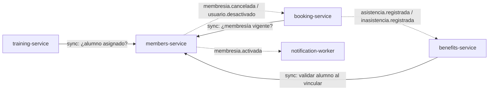

# ADR-001 — Límites de servicios por capacidad de negocio y propiedad de datos

| Campo | Valor |
|---|---|
| **Estado** | Aceptado |
| **Fecha** | 2026-10-07 |
| **Decisión del TP** | D1 |
| **Autores** | Equipo del TPI |
| **Relacionado con** | SPEC §3, §6, RN-12 a RN-27; [ADR-003](ADR-003-persistencia.md); [ADR-005](ADR-005-comunicacion.md) |

## Contexto

El SPEC describe un gimnasio con cinco áreas funcionales: identidad y membresías; agenda, reservas y asistencia; entrenamiento y nutrición; Club de Beneficios (que además se expone a partners de otros grupos); y notificaciones. Hay que decidir **cuántos servicios** construir y **dónde cortar**, considerando:

- **Invariantes fuertes** que exigen atomicidad: el cupo de una clase y sus reservas (RN-14: nunca más reservas que capacidad, aun con concurrencia); el saldo y los movimientos de puntos (RN-23: saldo nunca negativo).
- **Propiedad de datos**: cada dato debe tener un único dueño que lo escriba.
- **Capacidad publicada**: el Club de Beneficios es consumido por otros grupos y debe evolucionar con un contrato estable, independiente del resto.
- **Restricciones del equipo**: equipo chico, tiempo de cursada, necesidad de demostrar patrones (capas, hexagonal, CQRS, outbox, balanceo).

## Alternativas consideradas

### Alternativa A — Monolito modular

Una sola aplicación con módulos internos y una base.

| Pros | Contras |
|---|---|
| Simple de desarrollar, desplegar y depurar | No cumple el objetivo del TP (microservicios) |
| Transacciones ACID entre módulos | La API de partners queda acoplada al ciclo de despliegue de todo el sistema |
| Menor consumo de recursos | No permite escalar solo la parte más cargada (reservas) |

### Alternativa B — Servicios por entidad (grano fino)

Un servicio por entidad: usuarios, membresías, actividades, clases, reservas, asistencia, puntos, beneficios, planes, mediciones…

| Pros | Contras |
|---|---|
| Servicios muy pequeños | **Rompe invariantes:** cupo (clases) y reservas en servicios distintos obligan a una saga o a un lock distribuido para RN-14 |
| | Muchas llamadas síncronas encadenadas; latencia y fallas en cascada |
| | Inmanejable para el tamaño del equipo |

### Alternativa C — Servicios por capacidad de negocio (elegida)

Cinco servicios de negocio/soporte más un gateway, cortados por capacidad y propiedad de datos.

| Pros | Contras |
|---|---|
| Cada invariante fuerte queda **dentro** de un servicio (transacción local) | Algunas consultas necesitan datos de otro servicio (llamada síncrona o datos en el evento) |
| Cada servicio es dueño de sus datos y de su modelo | Más infraestructura que un monolito |
| La capacidad publicada (benefits) evoluciona sola | Consistencia eventual entre servicios |
| Tamaño adecuado para el equipo | |

### Alternativa D — Fusionar benefits dentro de booking

Los puntos se generan por asistencia; ponerlos juntos evita un evento.

| Pros | Contras |
|---|---|
| Acreditación por asistencia atómica | Mezcla dos capacidades con ciclos de cambio distintos |
| | La API pública de partners quedaría expuesta junto con la agenda; un problema de carga en reservas afectaría a los partners y viceversa |

## Decisión

Adoptamos la **alternativa C**:

| Servicio | Capacidad de negocio | Dueño de |
|---|---|---|
| `members-service` | Identidad y habilitación | Usuarios, roles, alumnos, profesionales, asignaciones, membresías |
| `booking-service` (+ `booking-indexer`) | Agenda y uso del gimnasio | Actividades, horarios, clases, **cupo**, reservas, asistencias |
| `benefits-service` | Fidelización (capacidad publicada) | Cuentas, **saldo**, ledger, beneficios, canjes, partners |
| `training-service` | Seguimiento del alumno | Planes de entrenamiento y alimenticios, mediciones, consultas |
| `notification-worker` | Comunicación saliente | Registro de emails enviados |
| `api-gateway` | Frontera técnica | — (no tiene datos de negocio) |

### Criterios aplicados

1. **Capacidad de negocio:** cada servicio corresponde a un área del SPEC que un actor reconoce ("mis reservas", "mis puntos", "mi plan").
2. **Propiedad de datos:** cada entidad del SPEC §6 tiene exactamente un servicio dueño. Los demás la conocen solo por ID o por copia en eventos.
3. **Consistencia transaccional dentro del agregado:** `Clase` (con su capacidad y ocupación) y `Reserva` viven en el mismo servicio y la misma base; reservar es una transacción local que verifica cupo, unicidad (RN-13), máximo diario de Musculación (RN-39) y superposición (RN-40). Lo mismo para `CuentaBeneficios` y `MovimientoPuntos` (RN-23). La asistencia vive con la reserva porque su registro cambia el estado de la reserva (RN-19, RN-21).
4. **Ritmo de cambio y exposición:** benefits se separa porque su API es un contrato con terceros.
5. **Perfil de carga:** booking es el más demandado (picos al abrir reservas) y es el único con 2 réplicas.
6. **Tecnología de datos distinta:** training usa documentos (MongoDB), lo que refuerza su separación (ADR-003).

### Relaciones entre servicios

Relación de tipo **cliente–proveedor**: members es proveedor ascendente (upstream) de identidad para todos. booking es upstream de benefits (asistencias). Ningún ciclo síncrono.

### Por qué no más servicios

- **Membresías separadas de usuarios:** la vigencia depende del alumno y su estado (ACTIVO/INACTIVO); separarlos agrega una llamada sin ganar independencia.
- **Asistencia separada de reservas:** rompería la transición atómica `CONFIRMADA → ASISTIDA` que ocurre al validar el ingreso mediante DNI.
- **Nutrición separada de entrenamiento:** comparten actor (alumno asignado), almacenamiento y patrón; el volumen no lo justifica. Se puede extraer más adelante si crece.
- **Servicio de autenticación separado:** login y usuarios comparten datos (credenciales, rol, estado); el gateway ya concentra la validación del token.
- **Partners separados de benefits:** la API de partners **es** el ledger; separarla obligaría a coordinar débitos entre servicios.

### Por qué no menos servicios

- **booking + benefits:** ver alternativa D.
- **members + booking:** la verificación de membresía es una sola consulta; juntarlos acoplaría identidad con la parte de mayor carga.
- **training dentro de members:** distinto modelo de datos y distinto actor principal (profesionales).
- **notification-worker dentro de members:** el envío de email es lento y falla por causas externas (SMTP); aislarlo evita que afecte las altas de membresía.

## Consecuencias

### Positivas

- Las reglas críticas (cupo, saldo) se garantizan con transacciones locales, sin sagas.
- Cada servicio puede probarse y desplegarse por separado.
- La API de partners tiene un ciclo de vida propio y un único dueño.
- El número de servicios es manejable por el equipo.

### Negativas

- members-service es una dependencia síncrona de varios servicios (punto crítico).
- Listados que combinan datos (ej. alumnos de una clase con su nombre) requieren composición.
- Consistencia eventual en puntos y en la vista de clases.

### Riesgos aceptados

| Riesgo | Probabilidad | Impacto | Mitigación |
|---|---|---|---|
| Caída de members bloquea reservas | Baja | Alto | Timeout corto, circuit breaker, health checks (ADR-005) |
| Límites mal elegidos que obliguen a mover datos | Media | Medio | Contratos por API/eventos; ningún acceso cruzado a bases |
| Crecimiento de training más allá de lo previsto | Baja | Bajo | Separable en nutrición/entrenamiento sin tocar los demás |

## Cómo se verificará

- **Propiedad de datos:** cada servicio tiene usuario de base con permisos solo sobre su base; un test de integración verifica que el usuario de booking **no** puede conectarse a `benefits_db`.
- **Sin imports cruzados:** CI falla si un módulo de `services/X` importa código de `services/Y` (los módulos Go separados lo impiden; se agrega chequeo con `go list`).
- **Invariante de cupo:** test de concurrencia con testcontainers (N reservas simultáneas sobre 1 lugar → exactamente 1 éxito) y prueba k6 sobre las 2 instancias.
- **Invariante de saldo:** test de canjes/débitos concurrentes → saldo nunca negativo.
- **Revisión:** todo PR que agregue una entidad indica su servicio dueño en la descripción.
